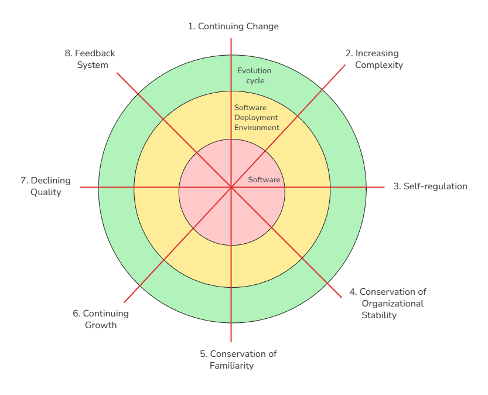

# Lehman's Laws of Software Evolution

**Category**: addenda
**Detection**: git-history
**Short description**: Real-world software must continually adapt, and its complexity grows unless explicitly managed.

## Overview

Lehman's Laws describe a basic fact of long-lived software: systems operating in the real world must continuously change to stay useful. That evolution is neither optional nor free. Each modification piles on complexity, and unless teams actively push back through refactoring, internal disorder grows — slowing development, raising risk, and making future changes more expensive.

Organizations hit hard limits set by team knowledge, coordination capacity, and familiarity with the system. Those limits can't be overcome simply by adding more people; as Brooks observed, that often makes things worse.

## Takeaways

- **Continuing Change**: systems must keep evolving or users will abandon them for alternatives that do.
- **Increasing Complexity**: changes pile up over time. Without deliberate refactoring, technical debt compounds and subsequent work slows.
- **Development Limits**: organizations can't accelerate delivery indefinitely. Team knowledge, process overhead, and coordination cost impose natural ceilings.
- **Quality Perception**: perceived quality drops over time, driven by rising expectations, environmental shifts, and accumulated small issues.

## Examples

An ERP system deployed in 2000 needs a constant stream of updates — new business rules, tech integrations, UI refreshes — just to stay relevant 25 years later. Adding the same functionality in 2025 takes noticeably longer than it did in 2005, even after periodic refactors, because complexity has compounded.

The Linux kernel is a positive example: it evolves continuously to support new hardware and requirements. Without that adaptation, it would have become obsolete. Its massive growth is managed through subsystem maintainers and strong review culture — a deliberate counter to Lehman's "increasing complexity."

## Signals
- `git_evolution.velocity_ratio`: accelerating vs. decaying commit velocity.
- `git_evolution.total_commits` over `age_days`: continuing-change indicator.
- `complexity.total_source_loc` growth rate (needs multiple snapshots).
- `hotspots`: growing hotspot files without offsetting refactors → Lehman's "increasing complexity."

## Scoring Rubric
- 🟢 **Pass**: repo actively evolves (continuing change), hotspots are managed (refactor commits visible), complexity stable.
- 🟡 **Watch**: continuing change present, but complexity creeping up.
- 🔴 **Concern**: velocity decaying while complexity grows — classic Lehman "declining quality."
- ⚪ **Manual**: not a git repo or too young.

## Evidence Format
- Cite `velocity_ratio`, `age_days`, and trend in LOC/hotspots.

## Remediation Hints
- Budget explicit refactor time proportional to feature work; Lehman says complexity grows unless managed.
- Watch for the slowdown: if velocity is dropping while bug count rises, debt is winning.
- Document architectural decisions so new contributors maintain intent.

## Origins

Meir "Manny" Lehman began this work in 1974, studying software including IBM's OS/360. Examining version histories and growth metrics, he produced three initial laws. Over the following decades, Lehman refined the framework, eventually expanding it to eight laws by the 1990s as more projects provided supporting evidence.

## Further Reading

- [Programs, Life Cycles, and Laws of Software Evolution (Lehman, 1980)](https://ieeexplore.ieee.org/document/1456074)
- [Laws of Software Evolution - The Nineties View](https://ieeexplore.ieee.org/document/637156)
- [The Evolution of the Laws of Software Evolution](https://link.springer.com/chapter/10.1007/978-3-540-75381-0_1)

## Related Laws

- [Brooks's Law](../teams/brooks.md)
- [Conway's Law](../teams/conway.md)
- [Technical Debt](../quality/tech-debt.md)
