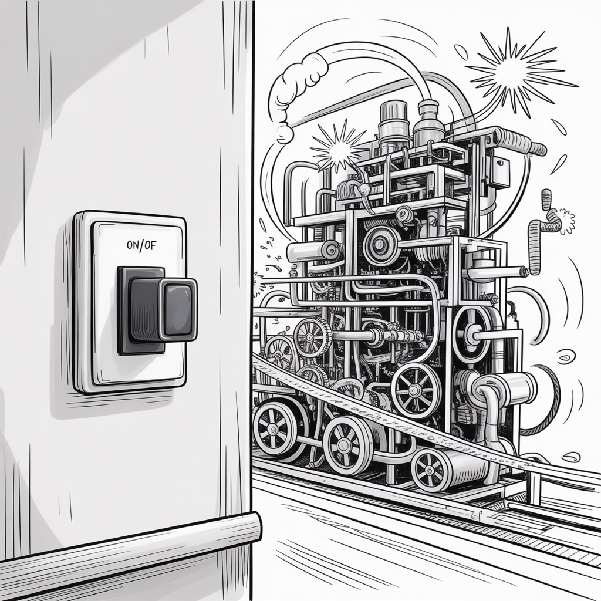

# The Law of Unintended Consequences

**Category**: addenda
**Detection**: manual
**Short description**: Changes in complex systems produce effects the designers did not anticipate.

## Overview

The Law of Unintended Consequences says outcomes are never fully predictable. Systems have complex interdependencies, human factors, and feedback loops that surprise you. Adding a feature may degrade performance through unexpected module interactions. Simplifying a UI might increase backend load because users suddenly click through more often. Fixing one bug uncovers another that depended on the first.

The principle is a reminder that our understanding of the systems we build is always incomplete. Ship with humility, measure after release, and expect surprises — pleasant and otherwise.

## Takeaways

- No matter how well you plan, any significant change in a complex system can produce results you didn't anticipate.
- Consequences come in three flavors: unexpected benefits, unexpected drawbacks, and perverse results where the action actually makes the original problem worse.
- In software, this often manifests as a fix or new feature introducing bugs or performance issues somewhere else entirely.

## Examples

Enabling a new logging feature for debugging fills the disk and crashes the system. A social network tweaks its engagement algorithm and inadvertently amplifies misinformation. A bug fix in one module triggers a regression in another module that was quietly depending on the old buggy behavior — Hyrum's Law in action.

## Signals
- Not directly detectable. Weakly proxied by reverting commits, incident post-mortems, or feature flags kept on indefinitely "just in case."

## Scoring Rubric
- ⚪ **Manual**: reflect on the prompts below.

## Reflection Prompts
- How often do your changes have knock-on effects on other systems?
- Do you run feature flags long enough to observe consequences, or ship and move on?
- In your last incident, could the cause have been anticipated? What process would have caught it?

## Remediation Hints
- Release in shadow mode or dark launches before cutting over.
- Keep feature flags long enough to collect real-world data.
- Post-incident: record the unintended consequence and the warning signal you could have watched.

## Origins

Sociologist Robert K. Merton popularized the term in the mid-20th century, though the concept has older roots (Adam Smith's "invisible hand" is a close cousin). Merton identified five sources of unanticipated consequences: ignorance, error, immediate interest overriding long-term considerations, basic values, and self-defeating prophecy.

## Further Reading

- [Unintended Consequences (Wikipedia)](https://en.wikipedia.org/wiki/Unintended_consequences)
- [The Unanticipated Consequences of Purposive Social Action (Merton, 1936)](https://www.jstor.org/stable/2084615)
- [Freakonomics](https://freakonomics.com/)

## Related Laws

- [Hyrum's Law](../architecture/hyrum.md)
- [Gall's Law](../architecture/gall.md)
