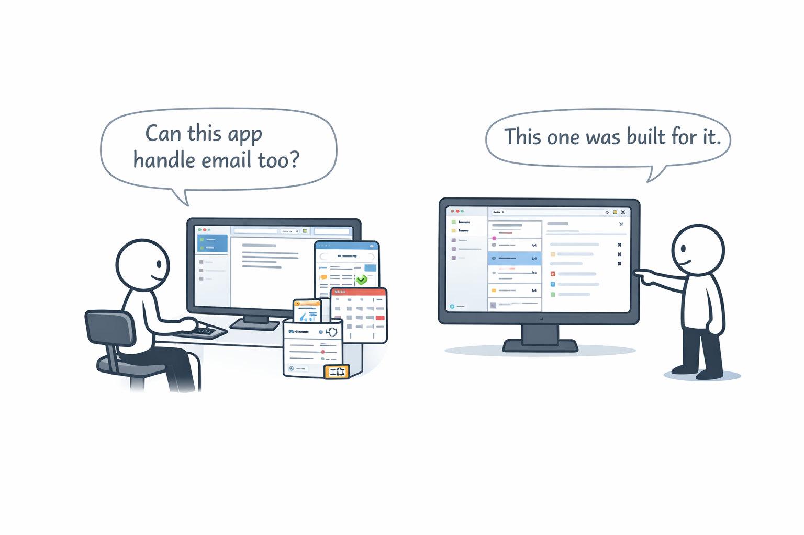

# Zawinski's Law

**Category**: addenda
**Detection**: code
**Short description**: Every program attempts to expand until it can read mail. Those programs which cannot so expand are replaced by ones which can.

## Overview

Zawinski's Law is a wry observation about software evolution: applications keep gaining features until they do everything, even things completely outside their original scope. It's a clever description of feature creep — the slow, inexorable expansion of a product beyond its reason for being.

As an application attracts more users, the pressure to add capabilities grows. A basic note-taking tool sprouts chat. A chat tool grows calendar invites. Zawinski's real point was about "platformization": once users spend a big chunk of their day inside an app, the pressure to make that app the platform for everything becomes overwhelming. Unchecked expansion can sabotage a product's original value. Adding features is easy; adding only the right features, and saying no to the rest, is the hard part.

## Takeaways

- Feature creep is the default. Over time, software accumulates features, leading to bloat.
- A lean, minimal application that gets popular will keep adding features until it looks like its competitors.
- Programs expand because users (and product managers) keep asking for "just one more feature" and the pressure to retain users feeds that loop.
- Each new feature adds complexity, making the product harder to use. Protect focus; resist platform sprawl.

## Examples

Netscape Navigator started as a slim browser and evolved into Netscape Communicator — a sprawling suite with browser, email, news, and web editing. It became sluggish and over-complicated, which opened the door for Firefox to win by stripping down to "just a fast browser." Firefox itself later gained plugins, themes, and weight.

Slack set out to "kill email" and then bolted on voice calls, video meetings, file sharing, bots, and app plugins. GitHub started as code hosting and now includes issues, wikis, project boards, discussions, CI pipelines, and package registries. The arc repeats.

## Signals
- `patterns.email_features`: files referencing SMTP / email libraries in a program that isn't primarily an email tool.
- Scope creep generally: features like notifications, chat, or user management bolted onto narrow tools.

## Scoring Rubric
- 🟢 **Pass**: scope stays narrow; no email/notification sprawl.
- 🟡 **Watch**: 1-2 email/notification features — may be legitimate.
- 🔴 **Concern**: `email_features ≥ 3` in a program whose core purpose isn't communication.
- ⚪ **Manual**: email IS the product (legitimate).

## Evidence Format
- Cite `patterns.email_features` count and one example file.

## Remediation Hints
- Ask "does this feature fit the product's core purpose?" before adding it.
- Cut features aggressively; bloat is the default path.
- If you catch yourself adding email/chat/notifications to a non-communication tool, stop and justify.

## Origins

Jamie Zawinski (jwz) formulated the law around 1995 at Netscape, where he was a key programmer on Navigator and later built the integrated Netscape Mail reader. He described the browser's evolution as "our contribution to the proof of the Law of Software Envelopment." Navigator started as a browser but by versions 2.0-3.0 had expanded to include mail and news. Reading mail was the canonical example because in the mid-90s you typically had to quit whatever you were doing and launch a separate program to check it.

## Further Reading

- [Zawinski's Law (Wikipedia)](https://en.wikipedia.org/wiki/Jamie_Zawinski#Zawinski's_Law)
- [Don't Let Architecture Astronauts Scare You (Joel Spolsky)](https://www.joelonsoftware.com/2001/04/21/dont-let-architecture-astronauts-scare-you/)
- [jwz's homepage](https://www.jwz.org/)

## Related Laws

- [Second-System Effect](../architecture/second-system.md)
- [YAGNI](../design/yagni.md)
