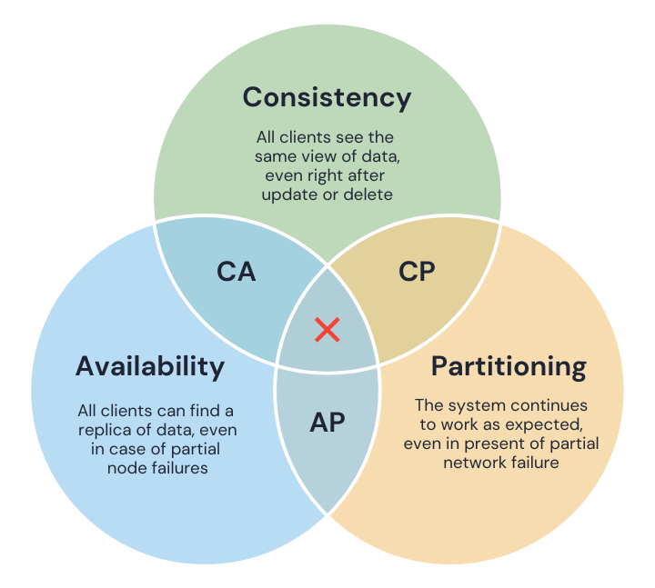

# CAP Theorem

**Category**: architecture
**Detection**: manual
**Short description**: A distributed data store can guarantee only two of: consistency, availability, partition tolerance.

## Overview

The CAP theorem states that a distributed system cannot simultaneously provide all three guarantees: **Consistency** (all nodes see the same data), **Availability** (every request receives a response), and **Partition Tolerance** (the system operates despite network failures).

Since network partitions are unavoidable in practice, systems must be partition-tolerant. This means choosing between consistency and availability when designing distributed architectures. The CAP theorem is a useful starting point, though it is a simplification that doesn't cover all aspects of the design space.

## Takeaways

- A distributed system can only guarantee two of three at once: Consistency, Availability, Partition Tolerance. When the network is healthy you can have all three — the moment a partition happens, you must give one up.
- When a split occurs, you choose: stay consistent (every node agrees, some requests fail) or stay available (every request answers, data may be stale). You can't fully have both.
- Real databases pick a side. MongoDB leans CP (blocks writes during partition for sync). Cassandra leans AP (keeps serving queries even if replicas disagree briefly).

## Examples

The **Domain Name System (DNS)** is designed AP (Available and Partition-Tolerant). Partitioned name servers still reply, even if records are briefly stale until zones sync up.

**MongoDB** is CP: blocks writes during a partition so all replicas stay in sync.
**Cassandra** is AP: serves queries even if replicas briefly disagree.

## Signals
- References to distributed data stores (Cassandra, DynamoDB, Postgres replicas, Redis cluster, Kafka, etc.).
- Patterns like read-replicas, quorum reads, eventual consistency handlers.

## Scoring Rubric
- ⚪ **Manual**: applicability is architectural — not a code-level heuristic.
- ➖ **N/A**: single-process CLI, single-user desktop app, etc.

## Reflection Prompts
- Is your primary data store distributed? Which CAP trade-off did you pick?
- When a partition happens, do you prioritize consistency (reject writes) or availability (accept and reconcile)?
- Are those trade-offs explicit in your code, or do they depend on unnoticed defaults?

## Remediation Hints
- Document your CAP stance per datastore in the architecture docs.
- Test partition behavior deliberately (Jepsen-style) if correctness matters.
- Don't pretend a distributed store is ACID-local; failure modes will find you.

## Origins

Eric Brewer proposed the theorem in 2000 in the context of web services; Gilbert and Lynch formalized it in 2002. Brewer observed that designers of large-scale systems faced three concerns: keeping data consistent across nodes, keeping the service up, and handling network unreliability. The formal proof showed that in a distributed system with shared data, you **must sacrifice either consistency or availability when a network partition occurs**. CAP became a guiding principle in the NoSQL movement and distributed database design in the 2000s.

## Further Reading

- [CAP Twelve Years Later: How the "Rules" Have Changed (Brewer)](https://www.infoq.com/articles/cap-twelve-years-later-how-the-rules-have-changed/)
- [Towards Robust Distributed Systems (Brewer, 2000 keynote PDF)](https://sites.cs.ucsb.edu/~rich/class/cs293b-cloud/papers/brewer-cap.pdf)
- [Brewer's Conjecture and the Feasibility of Consistent, Available, Partition-Tolerant Web Services (Gilbert & Lynch, 2002)](https://groups.csail.mit.edu/tds/papers/Gilbert/Brewer2.pdf)
- [A Critique of the CAP Theorem (Kleppmann)](https://www.cl.cam.ac.uk/research/dtg/archived/files/publications/public/mk428/cap-critique.pdf)
- [Designing Data-Intensive Applications (Kleppmann, book)](https://amzn.to/4pVAwU5)

## Related Laws

- [Fallacies of Distributed Computing](./distributed-fallacies.md)
