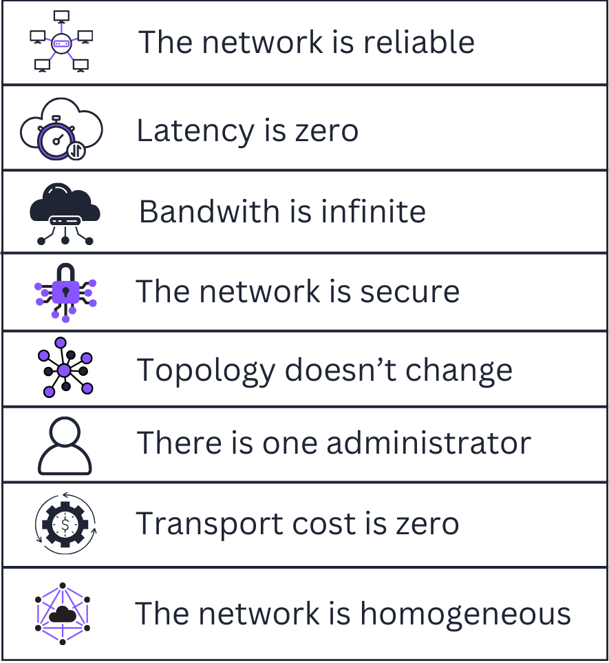

# Fallacies of Distributed Computing

**Category**: architecture
**Detection**: code
**Short description**: Eight false assumptions: network is reliable, latency is zero, bandwidth is infinite, network is secure, topology doesn't change, one administrator, transport cost is zero, network is homogeneous.

## Overview

The Fallacies of Distributed Computing are a set of eight false assumptions that new distributed system designers often make. These misconceptions stem from treating distributed systems identically to local computing environments. Developers frequently write code as though calling remote services works like invoking local functions, disregarding network latency and potential failures — an approach that generates serious consequences including unhandled errors, performance degradation, and security vulnerabilities.

The framework functions as a checklist of assumptions to avoid. By formalizing these fallacies, teams gain a structured reminder that networks are inherently unreliable and non-ideal, requiring systems built with defensive practices like caching, redundancy, and dynamic membership handling.

## Takeaways

- Networks drop messages, introduce delays, have finite throughput, and can be insecure — you need retries, timeouts, security measures, and discovery mechanisms.
- Subtle bugs emerge from these assumptions; treating latency as zero produces chatty remote calls that function locally but fail at scale.
- Defensive design addresses these through caching, redundancy, and accommodating topology changes.

## Examples

A distributed caching system that assumes zero network latency designs every lookup to fetch from remote nodes, resulting in performance thrashing. Another system assumes network security while transmitting unencrypted sensitive data or failing to validate inputs from other services, creating breach vulnerabilities. Topology changes breaking systems illustrate inadequate planning for machines being added or removed during operation.

## Signals
- `patterns.hardcoded_host_port`: hardcoded hostnames/ports indicate "topology doesn't change" assumption.
- `patterns.infinite_timeouts`: `timeout=None`/`-1`/`0` assumes "latency is zero" or "network is reliable."
- HTTP/RPC calls without retries or circuit breakers.
- No distinction between "service is down" and "service is slow" — both just block.
- Assumption of eventual delivery without idempotency keys.

## Scoring Rubric
- 🟢 **Pass**: explicit timeouts, retries, service discovery, idempotency — you've clearly thought about the fallacies.
- 🟡 **Watch**: some timeouts missing, some hardcoded hosts, inconsistent retry policies.
- 🔴 **Concern**: widespread infinite timeouts, hardcoded IPs/ports, no retry/backoff logic.
- ⚪ **Manual**: not a networked app.

## Evidence Format
- Cite `patterns.hardcoded_host_port` and `patterns.infinite_timeouts` counts with examples.

## Remediation Hints
- Always set explicit, bounded timeouts. Retries with exponential backoff.
- Service discovery (not hardcoded hosts). Secrets from config/vault, not source.
- Idempotency keys on write operations. Circuit breakers on flaky dependencies.

## Origins

Credited primarily to L. Peter Deutsch (with others like James Gosling adding to the list) around 1994 at Sun Microsystems. Initially there were seven fallacies; Gosling later added an eighth regarding network homogeneity. Deutsch recognized that engineers accustomed to local computing unconsciously assumed networks functioned perfectly, and formalized the list as a memorable checklist.

## Further Reading

- [Fallacies of Distributed Computing (Wikipedia)](https://en.wikipedia.org/wiki/Fallacies_of_distributed_computing)
- [Fallacies of Distributed Computing Explained (Rotem-Gal-Oz, PDF)](https://www.rgoarchitects.com/Files/fallacies.pdf)
- [The Eight Fallacies of Distributed Computing (Gosling)](https://nighthacks.com/jag/res/Fallacies.html)
- [Designing Data-Intensive Applications (Kleppmann)](https://amzn.to/4pVAwU5)
- [Foraging for the Fallacies of Distributed Computing](https://medium.com/baseds/foraging-for-the-fallacies-of-distributed-computing-part-1-1b35c3b85b53)

## Related Laws

- [CAP Theorem](./cap.md)
- [Murphy's Law](../quality/murphy.md)
