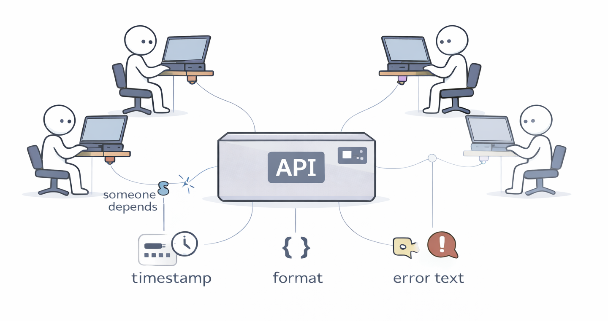

# Hyrum's Law

**Category**: architecture
**Detection**: code
**Short description**: With a sufficient number of users of an API, every observable behavior will be depended on by somebody.

## Overview

Hyrum's Law describes how the boundary between a software's documented interface and its implementation details gets blurred in practice. As user counts increase, the implementation effectively becomes the interface. Every observable trait — performance characteristics, error codes, ordering, timing — might be assumed by someone, which significantly constrains the ability to modify the system since even "internal" changes can impact users.

The actual software contract extends beyond the official specification to encompass observed real-world behavior. Maintainers cannot safely assume a change is invisible; consumers integrate APIs in unexpected ways, depending on things that were never promised.

## Takeaways

- As user volume increases, all system behaviors — including unintended side effects and bugs — become dependency points that users may rely upon.
- Maintainers cannot safely assume changes are invisible; consumers integrate APIs in unexpected ways, depending on timing, error messages, and formatting.
- The actual software contract extends beyond official specifications to encompass observed real-world behavior, including informal contracts like UI familiarity.

## Examples

**Microsoft Windows**: Undocumented behaviors and bugs that third-party applications depended on caused those applications to break when Microsoft changed or fixed them. Microsoft often had to maintain quirky behavior purely for compatibility.

**Library sorting behavior**: A library documents that it returns an unordered list, but in practice it returns sorted results. Users begin depending on that sort order. When the library later changes to truly unordered output, dependent code breaks — even though the docs never promised order.

## Signals
- `public_api.total_public_symbols`: the more you expose, the more can be depended on.
- Files with 20+ exports/public symbols (`public_api` signals at `watch` or `concern`).
- Absence of explicit API stability markers (`@deprecated`, `#[deprecated]`, `@internal`, `__all__` lists, `Sealed` classes).
- Public types returning internal data structures (dict/map of internals, raw ORM models).

## Scoring Rubric
- 🟢 **Pass**: small, deliberate public surface; clear internal/external split; stability markers present.
- 🟡 **Watch**: broad public surface with no stability indicators (20–40 exports per file).
- 🔴 **Concern**: very large public surface (>40/file or >500 repo-wide) AND no deprecation/internal markers.
- ⚪ **Manual**: internal-only library with one known caller; rubric doesn't apply.

## Evidence Format
- Cite `public_api` signals with file + export count.

## Remediation Hints
- Explicit `__all__` / `export {}` / `pub(crate)` to hide internals.
- Wrap internal types in dedicated DTOs at the boundary.
- Add deprecation annotations early; users depend on anything you don't explicitly forbid.

## Origins

The law is named after Hyrum Wright, a Google software engineer who articulated this observation around 2011–2012. His colleague Titus Winters coined the term "Hyrum's Law" in recognition of it, and it appears in the book *Software Engineering at Google*.

## Further Reading

- [Hyrum's Law (official site)](https://www.hyrumslaw.com/)
- [Software Engineering at Google — Hyrum's Law](https://abseil.io/resources/swe-book/html/ch01.html#hyrumapostrophes_law)
- [xkcd 1172: Workflow](https://xkcd.com/1172/)

## Related Laws

- [The Law of Leaky Abstractions](./leaky-abstractions.md)
