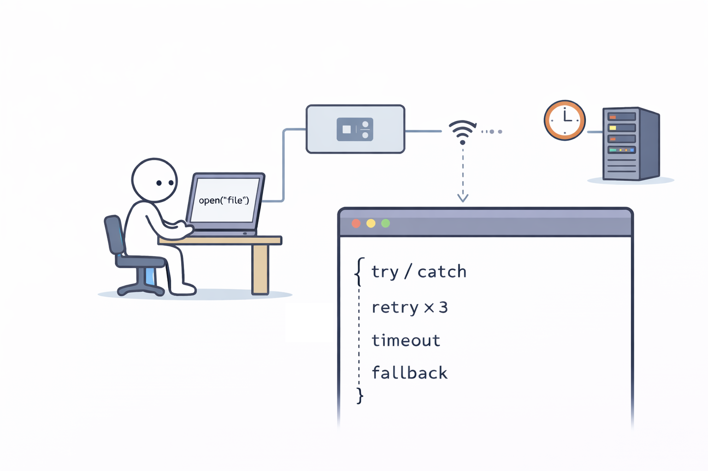

# The Law of Leaky Abstractions

**Category**: architecture
**Detection**: code
**Short description**: All non-trivial abstractions, to some degree, are leaky.

## Overview

This law observes that in complex systems, the abstractions we create — meant to hide complexity — inevitably fail in some scenarios. No abstraction, whether a library, framework, or tool, can completely hide the underlying complexity. An ORM demonstrates this when developers hit performance issues and must understand the SQL queries being generated beneath the surface.

The principle emphasizes that abstractions remain essential despite their inevitable limitations. Using high-level tools effectively still requires basic understanding of the underlying systems, because leakage manifests through performance issues, bugs, or unexpected behavior tied to lower layers.

## Takeaways

- Well-designed abstractions still have edge cases dependent on internal details.
- Using high-level tools requires basic understanding of underlying systems.
- "Leakage" manifests through performance issues, bugs, or unexpected behavior tied to lower layers.
- When building abstractions, minimize leakage and document potential failure points.

## Examples

**Memory Management**: Java and Python abstract manual allocation through garbage collection, yet leaks still happen and GC pauses impact performance, forcing developers to understand the internals.

**Networking**: Web developers treat HTTP requests as fast operations, but when latency spikes or packets drop, the network's reality leaks into your application.

## Signals
- `patterns.exit_in_lib`: process-exit / panic calls inside library code leak termination policy.
- Abstract interfaces that return raw HTTP errors, SQL codes, or filesystem errno to callers.
- Types named `*Manager`, `*Helper`, `*Util` — vague abstractions that usually leak.
- Callers of "abstract" APIs that need to catch implementation-specific exceptions.

## Scoring Rubric
- 🟢 **Pass**: abstractions map to domain concepts; errors are abstracted into domain errors at each boundary.
- 🟡 **Watch**: some abstractions leak low-level errors or require caller knowledge of implementation.
- 🔴 **Concern**: widespread leakage (`exit_in_lib` in multiple library files, raw HTTP/SQL exceptions bubbling up).
- ⚪ **Manual**: abstraction appropriateness depends on domain design — judge case by case.

## Evidence Format
- File:line of exit/panic-in-library or raw-error-in-public-signature examples.

## Remediation Hints
- Return domain errors, not library errors, from public functions.
- Don't use `sys.exit` / `panic!` / `process.exit` inside libraries — return a Result.
- If a caller needs to know "which" implementation to handle the error, the abstraction is wrong.

## Origins

Joel Spolsky introduced this law in a 2002 blog post, citing TCP and virtual memory as canonical examples. The concept aligns with earlier computing principles, particularly the notion that there's no free lunch when it comes to abstraction benefits.

## Further Reading

- [The Law of Leaky Abstractions (Joel Spolsky)](https://www.joelonsoftware.com/2002/11/11/the-law-of-leaky-abstractions/)
- [A Note on Distributed Computing (Waldo et al.)](https://scholar.harvard.edu/waldo/publications/note-distributed-computing)
- [The Art of the Metaobject Protocol (Kiczales)](https://web.archive.org/web/20110604013045/http://www2.parc.com/csl/groups/sda/publications/papers/Kiczales-IMSA92/for-web.pdf)

## Related Laws

- [Hyrum's Law](./hyrum.md)
- [Gall's Law](./gall.md)
