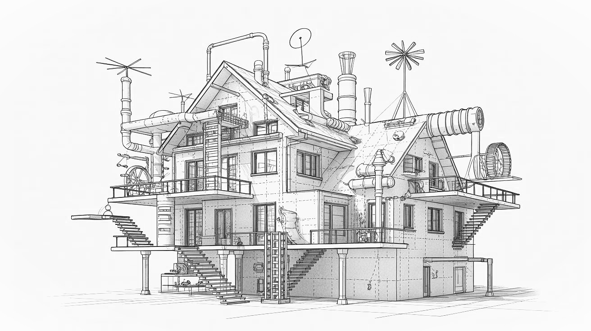

# The Second-System Effect

**Category**: architecture
**Detection**: git-history
**Short description**: The second system an architect designs tends to be over-engineered, dumping every idea held back from the first.

## Overview

A successful initial system is often followed by an overengineered successor. When designers are freed from the constraints that kept the first project lean, they tend to incorporate all the features initially excluded, add enhancements for edge cases, and include wishlist items. The result is typically an overly complex system that falls behind schedule.

Brooks observed this pattern at IBM with OS/360, where simpler earlier systems gave way to much more complex successors. The phenomenon reflects hubris — teams underestimate how much harder a larger scope becomes, and mistake their success on the first system for a license to go bigger on the second.

## Takeaways

- The first system remains lean due to constraints or inexperience; the second system incorporates all initially excluded extras, causing feature bloat.
- Overconfidence follows success; teams underestimate complexity when tackling larger projects.
- Over-engineering with excessive modules, generality, and features damages performance and maintainability.

## Examples

**Startup web service**: A minimal service succeeds; version 2 plans a complete microservice rewrite with extensive configuration, plug-in frameworks, and unrequested features — resulting in massive complexity and missed deadlines.

**Netscape Navigator**: After initial success, the company rewrote their browser into the Mozilla Suite. The lengthy rewrite allowed Internet Explorer to gain ground, and the resulting suite was widely deemed overly complicated.

## Signals
- `git_evolution.rewrite_hits`: commits mentioning "rewrite", "v2", "redesign", "from scratch."
- Sudden jump in `complexity.total_source_loc` paired with an "initial v2" commit.
- Parallel "v1" and "v2" directories with similar module names.
- Architecture that introduces plugin systems, abstraction layers, or DSLs that aren't justified by concrete requirements.

## Scoring Rubric
- 🟢 **Pass**: no rewrite signals or single focused rewrite with clear scope reduction.
- 🟡 **Watch**: one or two rewrite attempts with moderate scope creep.
- 🔴 **Concern**: repeated "v2/v3" commits, parallel old+new directories, growing complexity without feature parity.
- ⚪ **Manual**: no history to judge.

## Evidence Format
- Cite `git_evolution.rewrite_hits` and any parallel v1/v2 directory pairs.

## Remediation Hints
- Rewrites should reduce feature count, not add it. If scope is growing, stop.
- Port the old system's hard-won bug fixes before shipping the new one.
- Kill the old system or the new one — don't maintain both.

## Origins

Fred Brooks introduced the term in 1975 through *The Mythical Man-Month*, documenting his observations at IBM where successful small systems were followed by more ambitious ones that ran late or failed outright. OS/360 was the canonical cautionary tale.

## Further Reading

- [The Mythical Man-Month (Brooks)](https://amzn.to/4b4GU72)
- [Second-system effect (Wikipedia)](https://en.wikipedia.org/wiki/Second-system_effect)
- [Things You Should Never Do, Part I (Joel Spolsky)](https://www.joelonsoftware.com/2000/04/06/things-you-should-never-do-part-i/)

## Related Laws

- [YAGNI](../design/yagni.md)
- [Gall's Law](./gall.md)
- [Brooks's Law](../teams/brooks.md)
