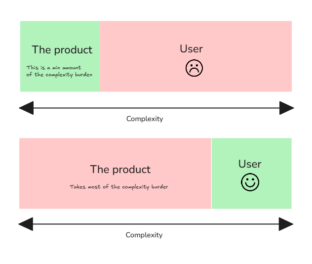

# Tesler's Law (Law of Conservation of Complexity)

**Category**: architecture
**Detection**: code
**Short description**: Every application has an inherent amount of complexity that cannot be removed — only moved.

## Overview

Tesler's Law, also known as the Law of Conservation of Complexity, establishes that every application has an inherent amount of irreducible complexity that can only be shifted, not eliminated. The principle centers on determining who manages this unavoidable complexity.

When software appears simple to users, the underlying system typically handles substantial hidden work. Conversely, a streamlined internal architecture may burden users with manual tasks. The law advocates for moving complexity away from the user experience whenever feasible — design is about allocating the complexity budget, not pretending it doesn't exist.

## Takeaways

- Good design requires developers to absorb complexity through smart defaults and algorithms, simplifying user interaction.
- UI systems requiring extensive user settings or steps misallocate complexity to the wrong party.
- Effective design conceals complexity through internal handling rather than elimination.

## Examples

**Meeting Scheduling**: Calendly automates scheduling logistics (absorbing complexity), whereas email coordination places the burden on users to find common availability.

**Database design**: Stored procedures simplify application code while increasing database layer complexity; moving logic out to the app simplifies the database but bloats the app. The complexity has to live somewhere.

## Signals
- `complexity.total_source_loc` paired with `complexity.long_functions`: if most functions are short, complexity may be concentrated in fewer large ones (or pushed to configuration / DSLs / external services).
- Very large config files, heavy magic metaprogramming, or reliance on an external orchestrator — complexity moved elsewhere.
- Huge switch/match statements centralizing all branching (complexity concentrated in one place — not bad, but visible).

## Scoring Rubric
- 🟢 **Pass**: complexity is concentrated in explicit, well-documented places; code elsewhere stays simple.
- 🟡 **Watch**: many medium-complexity functions without clear complexity "sinks."
- 🔴 **Concern**: complexity diffused across the codebase with no intentional centralization — every file has hairy logic.
- ⚪ **Manual**: assessment is subjective; use code review.

## Evidence Format
- Top 3 complex files (from `complexity` signals) with LOC/nesting.

## Remediation Hints
- Choose where complexity lives deliberately: at a boundary, inside one hard-to-read file, in configuration.
- When simplifying one place, note where the complexity went.
- Accept that "simple everywhere" usually means complexity was dumped on the user.

## Origins

Larry Tesler formulated this principle during the 1980s while working on the Apple Lisa and early GUI development. His observation: you can't make everything simple without someone handling the complexity. It represents a fundamental design trade-off rather than a solvable problem.

## Further Reading

- [Why Life Can't Be Simpler (Farnam Street)](https://fs.blog/why-life-cant-be-simpler/)
- [Law of Conservation of Complexity (Humanist.co)](https://humanist.co/blog/law-of-conservation-of-complexity/)
- [Simplicity is Overrated (Marvel)](https://marvelapp.com/blog/simplicity-is-overrated/)
- [Law of Conservation of Complexity (Wikipedia)](https://en.wikipedia.org/wiki/Law_of_conservation_of_complexity)

## Related Laws

- [Hyrum's Law](./hyrum.md)
- [Occam's Razor](../decisions/occam.md)
