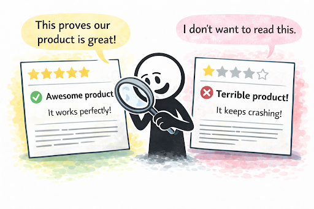

# Confirmation Bias

**Category**: decisions
**Detection**: manual
**Short description**: We favor information that confirms what we already believe.

## Overview

We all like being right. Confirmation bias is the brain's way of cheating to feel right more often — once we form an opinion, we unconsciously filter incoming information, giving weight to what supports our view and discounting what contradicts it. In software, this shows up most painfully during debugging, when a developer fixates on an initial suspect module and waves off evidence pointing elsewhere.

Awareness is half the fix. Teams that actively invite critique, assign someone to argue the other side, and anchor decisions in data rather than opinion are less likely to fall into the trap.

## Takeaways

- When reviewing code or debugging, notice if you're only seeking evidence that supports your initial hunch.
- Ask "what would I expect to see if I'm wrong?" — this forces the disconfirming lens.
- For team decisions, seek out dissenting voices and assign someone to investigate the opposing view.
- Base decisions on objective criteria — tests, metrics, experiments — rather than opinion.

## Examples

In code reviews, reviewers may skim trusted colleagues' work while scrutinizing juniors' code unfairly. Confirmation bias also shapes testing: developers write tests covering the happy paths they expect to work and neglect edge cases they don't want to think about. Teams counter this with fresh-eyed reviewers, adversarial testing, and post-mortems that examine what the team missed and why.

## Signals
- Not directly detectable from code.

## Scoring Rubric
- ⚪ **Manual**: reflect on the prompts below.

## Reflection Prompts
- When debugging, do you look for evidence the bug is where you think, or evidence it isn't?
- In PR review, do you look harder for flaws in code from people you disagree with?
- Does your team have a devil's-advocate role for major design choices?

## Remediation Hints
- Before committing to a hypothesis, spend 2 minutes actively trying to disprove it.
- Pre-mortems: "Imagine this project failed — what went wrong?"
- Rotate advocates and skeptics in design reviews.

## Origins

English cognitive psychologist Peter Cathcart Wason identified confirmation bias through his 1960 experiment (the Wason rule discovery task), demonstrating that people test hypotheses by seeking confirmations rather than disconfirmations. Wason coined the term, and decades of subsequent research have firmly established confirmation bias as a fundamental feature of human reasoning.

## Further Reading

- [Confirmation Bias: A Ubiquitous Phenomenon in Many Guises (Nickerson)](https://journals.sagepub.com/doi/10.1037/1089-2680.2.2.175)
- [On the Failure to Eliminate Hypotheses in a Conceptual Task (Wason, 1960)](https://www.tandfonline.com/doi/abs/10.1080/17470216008416717)
- [Thinking, Fast and Slow (Kahneman, book)](https://amzn.to/48WboH0)

## Related Laws

- [Dunning-Kruger Effect](./dunning-kruger.md)
- [Hanlon's Razor](./hanlon.md)
- [Goodhart's Law](../planning/goodhart.md)
