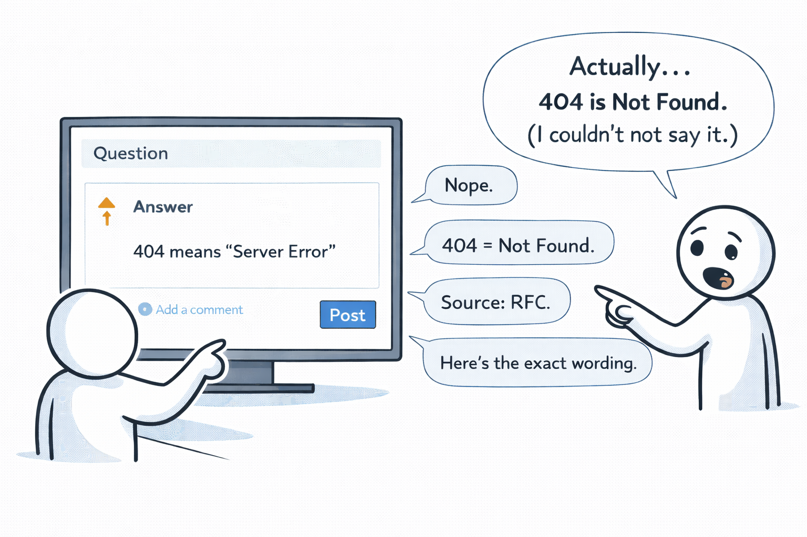

# Cunningham's Law

**Category**: decisions
**Detection**: manual
**Short description**: The best way to get the right answer on the internet is not to ask a question; it's to post the wrong answer.

## Overview

Cunningham's Law came out of early online communities — wikis, forums, mailing lists — where assertions reliably generated more engagement than questions. On Wikipedia, an incorrect claim tends to get fixed faster than a polite "could someone add information about X." On Stack Overflow and technical mailing lists, questions often sit unanswered while slightly-wrong answers attract swift corrections.

By committing to a concrete position, even an imperfect one, you convert a passive inquiry into an active discussion. People love being right more than they love helping.

## Takeaways

- People online are motivated to correct errors; proposing a potential solution — even a flawed one — accelerates finding the right answer.
- Questions may get silence while confident (even incorrect) assertions provoke engagement.
- Instead of asking abstract questions like "how should we do X?", offer a draft or prototype and let the feedback come to you.

## Examples

A developer struggling with an open-source library's configuration posts a question and gets no response. Applying Cunningham's Law, they instead post "For anyone else struggling, the fix is to set ConfigMode to False." If that's wrong, someone — possibly the maintainer — will show up to correct it.

A junior developer opens a PR with their best attempt rather than asking for theoretical guidance. Seniors review, suggest improvements, and the junior benefits from collective expertise without having to frame the question perfectly first.

## Signals
- Not detectable from code.

## Scoring Rubric
- ⚪ **Manual**: reflect on the prompts below.

## Reflection Prompts
- When stuck on a design, do you float a deliberately-wrong strawman to attract critique?
- Do your docs invite corrections, or present conclusions as final?
- Does your team reward "here's a rough take, please tear it apart" over polished-but-vague asks?

## Remediation Hints
- Write "straw proposals" for design reviews — explicitly flagged as "probably wrong, please improve."
- Low-stakes-wrong is faster than high-stakes-correct-in-a-vacuum.
- Don't over-polish docs that need feedback; get input early.

## Origins

Ward Cunningham — creator of the first wiki — is the namesake, but the law was actually formulated by his colleague Steven McGeady, who named it after advice Cunningham gave about early internet forums in the 1980s. McGeady described it in a 2010 comment on a New York Times blog. A French proverb, "Prêcher le faux pour savoir le vrai" ("preach the false to know the true"), expresses essentially the same idea.

## Further Reading

- [Cunningham's Law (Wikipedia)](https://meta.wikimedia.org/wiki/Cunningham%27s_Law)
- [The Wiki Way (Leuf & Cunningham)](https://en.wikipedia.org/wiki/The_Wiki_Way)
- [How to Ask Questions the Smart Way (Raymond)](http://www.catb.org/~esr/faqs/smart-questions.html)

## Related Laws

- [Linus's Law](../quality/linus.md)
- [Broken Windows Theory](../quality/broken-windows.md)
