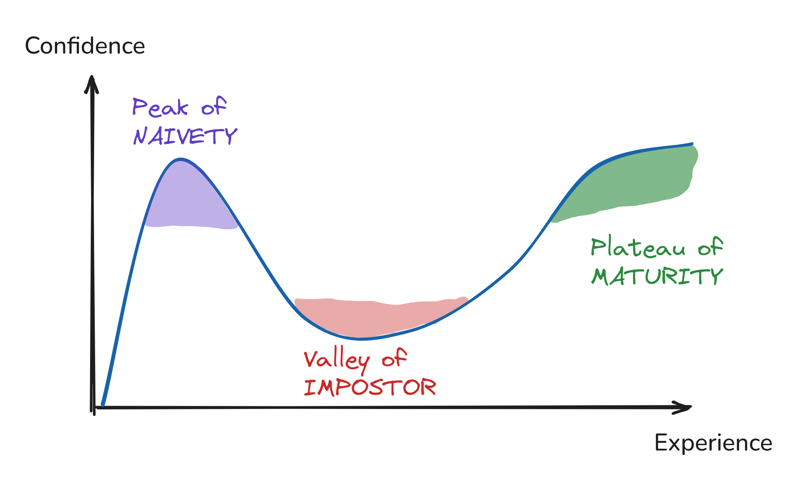

# The Dunning-Kruger Effect

**Category**: decisions
**Detection**: manual
**Short description**: Low-skill individuals overestimate their ability; experts underestimate theirs.

## Overview

The Dunning-Kruger Effect captures the disconnect between confidence and actual competence. People with little knowledge lack the metacognitive awareness to recognize their gaps, and so inflate their self-assessment. As they learn more, they encounter the real complexity of the domain and confidence drops — the so-called "valley of despair" — before recovering as genuine skill develops.

The very skills needed to perform well are often the same skills needed to accurately assess performance. That's why beginners can't see what they're missing, and why experts temper their statements with "it depends."

## Takeaways

- Confidence without context is unreliable. Early certainty often signals ignorance, not mastery.
- Awareness grows faster than skill. Learning initially reduces confidence before rebuilding it.
- Real experts speak in ranges, trade-offs, and probabilities, not with uniform confidence across every topic.

## Examples

Junior developers tend to offer precise, confident estimates; seasoned developers answer with ranges and the familiar "it depends." The juniors aren't lying about their certainty — they haven't yet encountered the gaps in their own knowledge. The same pattern shows up with emerging technologies: enthusiasm peaks among those with the least hands-on experience, while veterans take a more circumspect view.

## Signals
- Not detectable from code.

## Scoring Rubric
- ⚪ **Manual**: reflect on the prompts below.

## Reflection Prompts
- When was the last time you were confidently wrong about a technical decision?
- How do you test confidence against expertise on your team? (Reviews? Pairing? Retros?)
- Do junior engineers feel safe saying "I don't know"?

## Remediation Hints
- Culture: normalize "I don't know" and "I was wrong."
- Require written design docs for non-trivial choices; claims should survive review.
- Pair early-career engineers with skeptical seniors for high-stakes decisions.

## Origins

Psychologists David Dunning and Justin Kruger documented the effect in a 1999 Cornell University study. Their research showed low performers systematically overestimated their abilities on logic, grammar, and humor tests, while high performers underestimated theirs. The underlying mechanism: the skills required to perform well in a domain are often the same skills needed to assess performance accurately — so those who lack skill also lack the ability to recognize that they lack it.

## Further Reading

- [Dunning-Kruger Effect (Wikipedia)](https://en.wikipedia.org/wiki/Dunning%E2%80%93Kruger_effect)
- [Unskilled and Unaware of It (Kruger & Dunning, 1999)](https://www.avaresearch.com/files/UnskilledAndUnawareOfIt.pdf)
- [We Are All Confident Idiots (David Dunning)](https://psmag.com/social-justice/confident-idiots-92793/)
- [Thinking, Fast and Slow (Kahneman, book)](https://amzn.to/4sfXfMr)

## Related Laws

- [Hanlon's Razor](./hanlon.md)
- [Brooks's Law](../teams/brooks.md)
