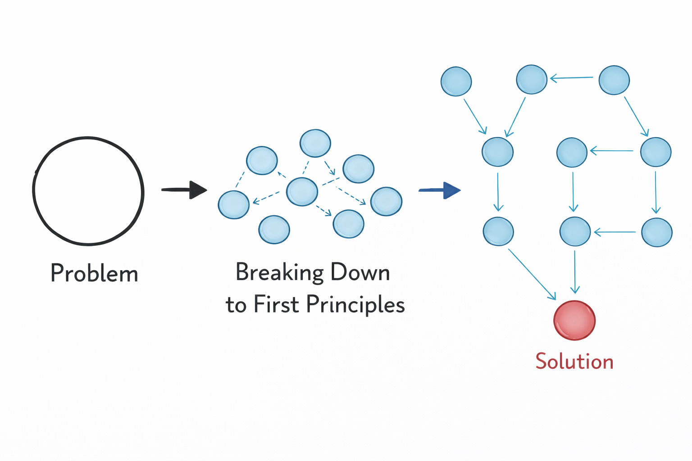

# First Principles Thinking

**Category**: decisions
**Detection**: manual
**Short description**: Decompose problems to their fundamental truths and reason up from there.

## Overview

First-principles thinking means attacking a problem by questioning existing solutions rather than inheriting them. Instead of "we'll do X because that other project did X," ask: what are we actually trying to accomplish? What's a real constraint versus an assumption carried over from elsewhere? The approach is useful for incremental improvements and essential for fundamental changes.

In software, this means challenging system assumptions: "if we started from scratch today, how would we build this?" It's the line of thinking that produced microservices (questioning monoliths) and serverless (questioning the need to run servers at all). The downside is cost — first-principles reasoning takes mental effort and isn't always necessary when existing patterns already solve the problem well.

## Takeaways

- Don't accept the problem as presented. Break it into fundamental parts and question your assumptions: are they genuinely true or merely accepted defaults?
- Just because "everyone uses Framework Y for this" isn't a reason you should. Ask why.
- When estimating, decompose features from basics instead of comparing to "similar" past work. The similarity may be superficial.

## Examples

Before SpaceX, rocket launches were expensive because the industry used costly materials and single-use vehicles. Elon Musk asked the fundamental question: what is a rocket actually made of? Mostly aluminum, titanium, copper, and carbon fiber — raw materials that cost far less than a finished rocket. That reframe led to in-house manufacturing and reusable launch vehicles.

A company paying for proprietary analytics software questioned whether they needed it. The platform boiled down to ingesting data, running statistics, and generating reports — all achievable with open-source tools and custom code. A Python proof-of-concept delivered 90% of the functionality at a fraction of the cost.

## Signals
- Not directly detectable from code; a thinking discipline.

## Scoring Rubric
- ⚪ **Manual**: reflect on the prompts below.

## Reflection Prompts
- When you last said "we can't do X," did you go back to fundamentals to check?
- Are your technical constraints real physics/business rules, or inherited assumptions?
- When was the last time you asked "why do we do it this way?" and got a non-historical answer?

## Remediation Hints
- Reserve time for design from first principles on major decisions — don't just pattern-match prior art.
- Write down your assumptions; check which are actual constraints vs. cargo cult.
- "How would I build this if I knew nothing about the current system?" is a useful prompt.

## Origins

The concept goes back to classical philosophy. Aristotle defined first principles as foundational propositions that cannot be derived from other truths — the bedrock of knowledge. René Descartes pushed the idea further, insisting on starting from fundamental certainties ("I think, therefore I am"). In modern times, Elon Musk popularized first-principles thinking in engineering contexts, crediting the approach for SpaceX and Tesla breakthroughs by refusing to accept inherited industry costs as fixed.

## Further Reading

- [First Principles: The Building Blocks of True Knowledge (Farnam Street)](https://fs.blog/first-principles/)
- [Aristotle's Logic (Stanford Encyclopedia of Philosophy)](https://plato.stanford.edu/entries/aristotle-logic/)
- [How to Solve It (Pólya)](https://amzn.to/4b9q3Qo)

## Related Laws

- [Occam's Razor](./occam.md)
- [Inversion](./inversion.md)
- [KISS](../design/kiss.md)
- [Gall's Law](../architecture/gall.md)
