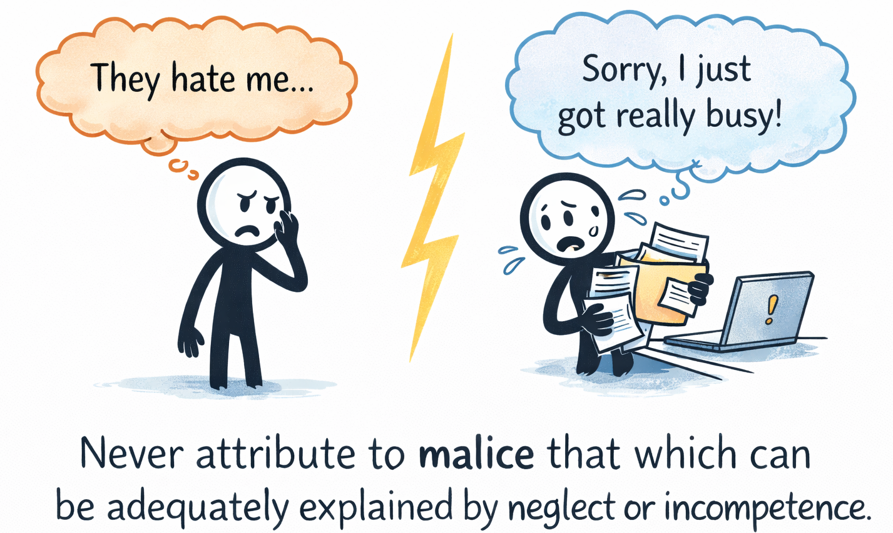

# Hanlon's Razor

**Category**: decisions
**Detection**: manual
**Short description**: Never attribute to malice that which is adequately explained by stupidity (or carelessness).

## Overview

Hanlon's Razor advises against assuming malicious intent when outcomes are just as easily explained by human error, ignorance, or haste. When something breaks — a security vulnerability sneaks into a release, a config change takes down prod, a colleague's PR nukes your module — the cause is almost always a mistake, not sabotage.

The practical upshot is to respond with support and investigation rather than blame. Malicious actors do exist, especially in security contexts, but day-to-day development problems usually have simpler explanations: a typo, a missed review, a wrong environment variable.

## Takeaways

- When something fails, it's typically an error or misunderstanding rather than intentional harm.
- Before concluding "the system was hacked" or "someone broke this deliberately," explore simpler explanations like a missed config or a typo.
- Problematic colleague code likely reflects being rushed or lacking context, not sabotage; approach with inquiry rather than accusation.

## Examples

A customer reports all their data disappeared. Rather than suspecting sabotage, investigation reveals that when a user's account name was empty, the cleanup script deleted every record — a boundary condition bug, not malice.

For sudden server traffic spikes, check for misconfigured clients or known patterns before assuming a DDoS. Most unusual system behavior traces back to mistakes rather than intent.

## Signals
- Not detectable from code.

## Scoring Rubric
- ⚪ **Manual**: reflect on the prompts below.

## Reflection Prompts
- When a teammate's code breaks something, is your first assumption "they didn't check" or "they cut corners"?
- In post-incident reviews, how often is the root cause a mistake rather than a bad actor?
- Do you default to charitable interpretations of unexpected PRs / decisions?

## Remediation Hints
- Blameless post-mortems. Default to "system made this mistake possible" over "person was careless."
- If you find "malice" is the explanation, double-check — it's almost always a miscommunication.

## Origins

Robert J. Hanlon submitted the principle to a 1980 Murphy's Law compilation. Similar sentiments show up earlier: Napoleon and Goethe both expressed versions of "never ascribe to malice what can be explained by incompetence." The modern formulation stuck because the name was catchy and the lesson useful in incident review.

## Further Reading

- [Hanlon's Razor (Wikipedia)](https://en.wikipedia.org/wiki/Hanlon%27s_razor)
- [Blameless Post-Mortems (Etsy)](https://www.etsy.com/codeascraft/blameless-postmortems/)
- [The Field Guide to Understanding 'Human Error' (Dekker)](https://amzn.to/3ZqHbGG)

## Related Laws

- [Occam's Razor](./occam.md)
- [Goodhart's Law](../planning/goodhart.md)
- [Postel's Law](../quality/postel.md)
