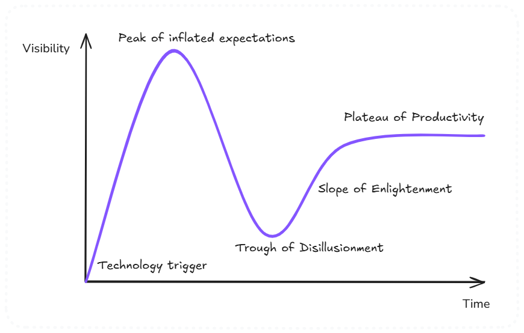

# The Hype Cycle & Amara's Law

**Category**: decisions
**Detection**: manual
**Short description**: We overestimate a technology's impact short-term and underestimate it long-term.

## Overview

This pair of laws captures the familiar boom-and-bust arc of new technology. Gartner's Hype Cycle describes the pattern: a new technology triggers inflated expectations, hits a trough of disillusionment when reality fails to match the pitch, then gradually climbs a slope of enlightenment toward productive mainstream adoption. Amara's Law states that we overestimate the short-term impact of a technology and underestimate its long-term impact.

Many buzzword technologies arrive as game-changers and then fade when they can't deliver on the hype. Some of those same technologies then quietly mature and eventually find genuine applications. The lesson is to keep healthy skepticism during the hype, while staying open-minded about long-term adoption once the dust settles.

## Takeaways

- People overestimate what a new technology can do in the near term, leading to unrealistic expectations.
- Over the longer run, the same technology's real potential often exceeds early predictions.
- Don't get swept up in the hype cycle; evaluate tools by proven value, not buzz.
- Treat innovation as a limited budget. Use stable, proven tech for most needs and adopt hyped technology only when it solves a real problem.

## Examples

AI went through massive hype in the 1960s and 70s, when general AI seemed just around the corner. When the predictions failed, an "AI winter" set in and many researchers abandoned the field. Decades of quiet progress later, AI is transforming healthcare, code generation, and more.

Microservices followed a similar path — promoted as a universal scaling solution, then hitting a trough when teams discovered how hard it is to run hundreds of services. Today's more measured approach is actually delivering value in the right contexts.

## Signals
- Dependencies on recently-hot frameworks/libraries (harder to detect without version data).
- Rewrite commits chasing new technology (React class → hooks → server components, or similar churn).

## Scoring Rubric
- ⚪ **Manual**: requires product/strategic judgment.

## Reflection Prompts
- What technology did you adopt in the last 2 years that turned out to be a fad?
- What did you dismiss 5 years ago that you now rely on?
- Are you currently rewriting because of genuine value or because of hype?

## Remediation Hints
- Wait for technology to cross the Trough of Disillusionment before betting on it.
- Don't dismiss technology because it's being over-hyped — it might still matter in 10 years.
- Track hype-driven churn in your own codebase.

## Origins

Amara's Law is named after Roy Amara, an American researcher, futurist, and president of the Institute for the Future. The Gartner Hype Cycle was introduced in 1995 by Gartner analyst Jackie Fenn, who noticed a recurring pattern in the maturity of emerging technologies and captured it as a visual graph. The two ideas fit together neatly: Amara describes the emotional misjudgment, Gartner describes the resulting shape over time.

## Further Reading

- [Gartner Hype Cycle](https://www.gartner.com/en/research/methodologies/gartner-hype-cycle)
- [Institute for the Future](https://www.iftf.org/)
- [Amara's Law (Wikipedia)](https://en.wikipedia.org/wiki/Roy_Amara)

## Related Laws

- [Lindy Effect](./lindy.md)
- [Goodhart's Law](../planning/goodhart.md)
- [Second-System Effect](../architecture/second-system.md)
