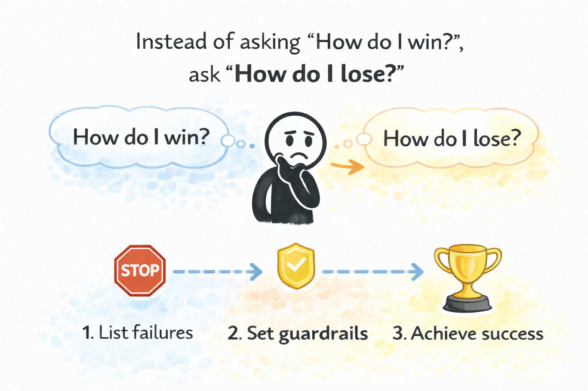

# Inversion

**Category**: decisions
**Detection**: manual
**Short description**: Solve problems by imagining the opposite outcome and working backward from what would cause it.

## Overview

Inversion means considering the opposite outcome and working backward from it. Rather than designing exclusively for the happy path, you deliberately account for failure scenarios: what if the database goes down? What if latency explodes? What if a malicious user probes this endpoint?

By asking how a system could break, you end up building in circuit breakers, retries, failover, and validation — defensive design that produces resilient solutions by pre-empting weaknesses. Inversion complements first-principles thinking: one asks what you're trying to achieve, the other asks what would stop you.

## Takeaways

- For any goal, pose the inverted question. If your aim is on-time delivery, ask "what would cause us to miss the deadline?" and defuse those factors.
- Run pre-mortems: imagine the project has already failed and work backward to why. Optimistic planning misses risks that this exercise reveals.
- In design and testing, consider edge cases and misuse. "How could a malicious user compromise this API?" drives better validation, rate limiting, and auth.

## Examples

Netflix's Chaos Monkey is inversion as engineering practice — it deliberately kills production servers to confirm the system can handle their absence. Rather than hoping for resilience, it forces the system to prove it.

Test-Driven Development is another form: writing a failing test first forces you to think about what the code must not do before deciding how to make it do the right thing.

## Signals
- Not directly detectable; a reasoning strategy.

## Scoring Rubric
- ⚪ **Manual**: reflect on the prompts below.

## Reflection Prompts
- When planning a feature, do you ever ask "what would make this fail catastrophically"?
- Do your design docs include a "how this could go wrong" section?
- Before launch, do you explicitly list failure modes and probe each?

## Remediation Hints
- Pre-mortems: imagine the project failed; trace backward to what caused it.
- "How could a malicious actor misuse this?" — invert security.
- "What would make the user ragequit?" — invert UX.

## Origins

Investor Charlie Munger popularized inversion with his quote: "All I want to know is where I'm going to die, so I'll never go there." He credited the 19th-century mathematician Carl Gustav Jacobi, who systematically inverted problems as a mathematical technique ("invert, always invert"). Stoic philosophy applied the same idea through *premeditatio malorum* — the premeditation of adversity — visualizing worst-case scenarios to prepare for them.

## Further Reading

- [Poor Charlie's Almanack (Munger)](https://www.stripe.press/poor-charlies-almanack)
- [Antifragile (Taleb)](https://en.wikipedia.org/wiki/Antifragile_(book))
- [Inversion and the Power of Avoiding Stupidity (Farnam Street)](https://fs.blog/inversion/)

## Related Laws

- [First Principles Thinking](./first-principles.md)
- [Murphy's Law](../quality/murphy.md)
- [Premature Optimization](../planning/premature-optimization.md)
