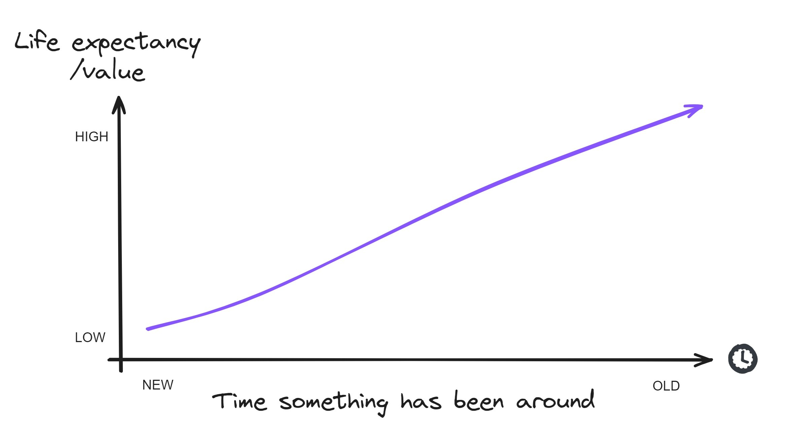

# The Lindy Effect

**Category**: decisions
**Detection**: git-history
**Short description**: For non-perishable things, each additional period of survival implies a longer remaining life expectancy.

## Overview

The Lindy Effect flips our usual intuition about aging. For living creatures, older means less remaining life expectancy. For technology and ideas, it's the opposite: the longer something has been in use, the more likely it is to remain in use.

Time is a brutal filter. What survives decades tends to do so because it works — it has passed through changing fashions, competing alternatives, and real-world stress. The principle pushes back on the constant chase for novelty, since the fundamentals of software (core algorithms, data structures, design paradigms) evolve slowly. Bet on what has already endured.

## Takeaways

- Long-established technologies, tools, and concepts are likely to persist into the future.
- Invest in timeless skills and proven fundamentals (algorithms, core languages, design principles) rather than every new framework.
- When evaluating technology, choose boring tech that has already demonstrated staying power.

## Examples

COBOL, created in 1959, is still running decades later. Estimates suggest 70-80% of global financial transactions touch COBOL code in banking systems — not because it's fashionable, but because it works and the replacement cost is brutal.

JavaScript frameworks like AngularJS and Ember.js rose and fell, while the underlying JavaScript language and browser APIs have endured 25+ years and will almost certainly keep going. The language is Lindy; the frameworks built on it, less so.

## Signals
- `hotspots.stable_ancients`: files >2 years old AND stable recently — high Lindy candidates.
- `git_evolution.age_days`: long-lived repo.
- Dependencies on technologies old enough to have outlived their critics (SQL, Unix, Make, Emacs).

## Scoring Rubric
- 🟢 **Pass**: stable ancient files present + core dependencies on mature tech.
- 🟡 **Watch**: mix of old stable + recent churn — reasonable.
- 🔴 **Concern**: no stable code, everything rewritten constantly.
- ⚪ **Manual**: too young to judge.

## Evidence Format
- Cite `stable_ancients` count and mention any notable old-and-unchanged files.

## Remediation Hints
- Bet on boring tech for long-lived systems — it's already survived scrutiny.
- When choosing between a 20-year-old tool and a 2-year-old one, the 20-year-old will likely outlast.
- Don't mistake novelty for improvement.

## Origins

Albert Goldman coined the term in 1964, referencing Lindy's Delicatessen in New York, where comedians observed that a show's past run length predicted its future run length. Nassim Nicholas Taleb later popularized the concept in *The Black Swan* (2007) and *Antifragile* (2012), framing it as a heuristic for the survival of non-perishable things — ideas, technologies, and institutions.

## Further Reading

- [Antifragile: Things That Gain from Disorder (Taleb)](https://amzn.to/4bc1Ust)
- [An Expert Called Lindy (Taleb)](https://medium.com/incerto/an-expert-called-lindy-fdb30f146eaf)
- [Lindy Effect (Wikipedia)](https://en.wikipedia.org/wiki/Lindy_effect)

## Related Laws

- [Hyrum's Law](../architecture/hyrum.md)
- [Postel's Law](../quality/postel.md)
- [Hype Cycle & Amara's Law](./hype-cycle.md)
