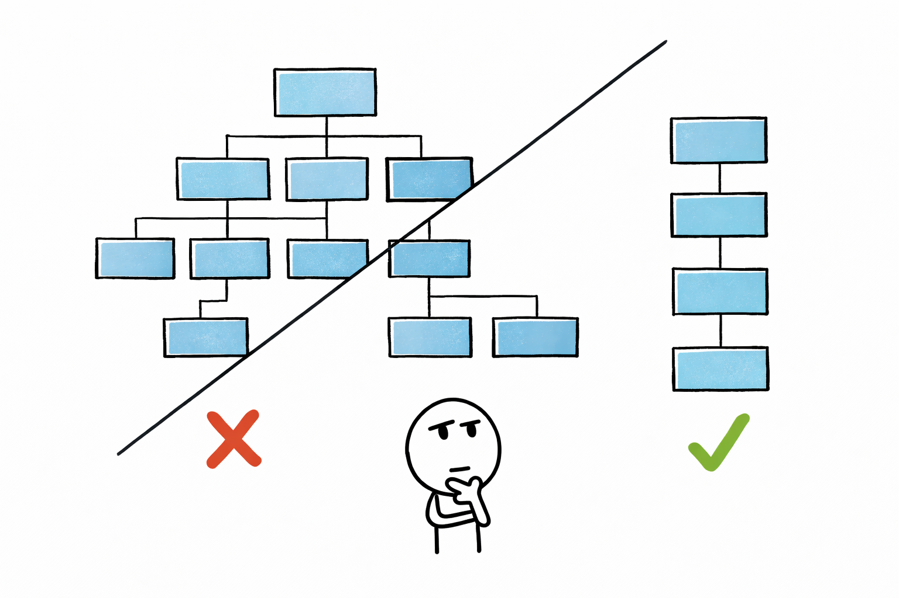

# Occam's Razor

**Category**: decisions
**Detection**: manual
**Short description**: The simplest explanation is usually correct.

## Overview

Occam's Razor is the problem-solving principle that the simplest explanation is usually the right one. In software, it aligns closely with KISS ("Keep It Simple, Stupid"). Simple implementations have fewer moving parts, fewer failure modes, and lower cognitive overhead.

The principle also pushes back against over-engineering. If a monolith and a single database meet the requirements, splitting the system into five microservices and three datastores adds complexity without delivering corresponding value. Simpler isn't always right, but it's the right default.

## Takeaways

- Simple code is easier to understand, maintain, and debug. Complex code creates more failure points. Eliminate unnecessary components.
- When debugging, explore the straightforward explanation before chasing exotic theories.
- Extra features can complicate a product without delivering real value. Minimalism is often the win.

## Examples

When a build breaks, check for the simple causes first: a typo, a missing semicolon, a bad config value — not a compiler regression or corrupted dependency cache. As Einstein put it, "Everything should be made as simple as possible, but not simpler." The trick is finding the floor, not just stopping at the first level of simplicity.

## Signals
- Not detectable from code; debugging heuristic.

## Scoring Rubric
- ⚪ **Manual**: reflect on the prompts below.

## Reflection Prompts
- When debugging, do you start with "what changed" or jump to exotic theories?
- Do your post-mortems cite complex multi-factor failures, or usually one dumb thing?
- When a test fails intermittently, is your first guess "flaky framework" or "real race"?

## Remediation Hints
- Check the dumb thing first: typo, stale cache, forgot to redeploy, wrong branch.
- Simple explanations are prior-probability wins; elaborate ones need proportionally more evidence.

## Origins

The principle traces to William of Ockham, a 14th-century English Franciscan friar and philosopher. His Latin formulation — "Pluralitas non est ponenda sine necessitate" ("plurality should not be posited without necessity") — became a foundation of scientific methodology and logical reasoning, eventually crystallizing into the modern shorthand "the simplest explanation is usually correct."

## Further Reading

- [Simplicity (Stanford Encyclopedia of Philosophy)](https://plato.stanford.edu/entries/simplicity/)
- [Ockham's Razors: A User's Manual](https://amzn.to/4jfnRZX)
- [Inference to the Best Explanation (Lipton)](https://www.routledge.com/Inference-to-the-Best-Explanation/Lipton/p/book/9780415242028)
- [No Silver Bullet (Wikipedia)](https://en.wikipedia.org/wiki/No_Silver_Bullet)

## Related Laws

- [KISS](../design/kiss.md)
- [YAGNI](../design/yagni.md)
- [Gall's Law](../architecture/gall.md)
