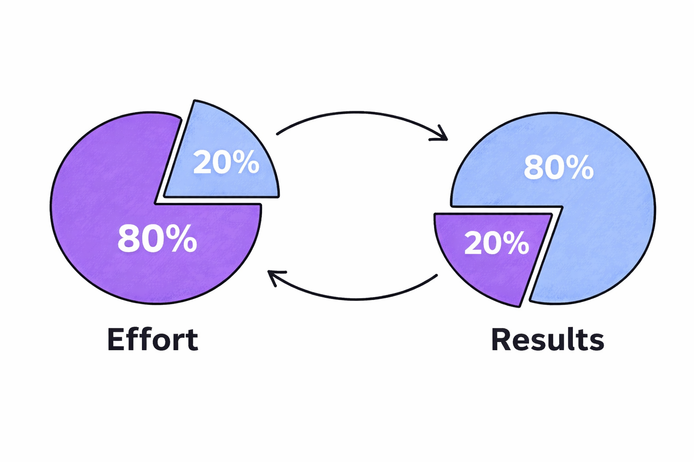

# The Pareto Principle (80/20 Rule)

**Category**: decisions
**Detection**: git-history
**Short description**: Roughly 80% of outcomes come from 20% of causes.

## Overview

The Pareto Principle is more observation than law, but the 80/20 pattern shows up across domains with uncanny regularity. In software, it's often stated as "80% of runtime is spent in 20% of the code." That observation guides optimization: rather than tuning everywhere, profile to find the hotspots and focus there.

The principle also shapes product thinking — a small set of core features usually covers most user needs. Recognizing that not all priorities are equal helps teams avoid spreading effort uniformly across work of wildly unequal impact.

## Takeaways

- Find the vital 20% — features driving usage, bugs driving crashes, modules driving churn — and focus there for maximum impact.
- Don't spend equal effort everywhere; rarely-used code needs different optimization than hotspots.
- The ratio isn't always 80/20; use profiling, analytics, and data to find the actual distribution.
- As an engineer or manager, identify which of your personal tasks generate the most value (core features, mentoring, unblocking others).

## Examples

Microsoft found that about 20% of bugs in Windows and Office caused 80% of all crashes, with 1% of bugs responsible for roughly 50% of errors. Targeting that critical subset dramatically improved stability.

Usage analysis on many products reveals that only 5-10 out of 50 features (10-20%) are used by 80%+ of users. Streamlining the UI around the core set beats trying to polish everything. Performance bottlenecks follow the same shape: a small slice of the codebase causes most of the defects and slowdowns.

## Signals
- `hotspots.pareto_concentration_pct`: percentage of files producing 80% of churn.
- `bus_factor.bus_factor`: concentration of authorship.
- Repo metrics showing a few files / modules / features dominate activity.

## Scoring Rubric
- 🟢 **Pass**: healthy concentration (roughly 20% of files → 80% of churn — expected shape, focus effort there).
- 🟡 **Watch**: flat distribution (churn spread evenly) — possibly diluted effort.
- 🔴 **Concern**: extreme concentration (<5% of files → 80% of churn) — single-point risk.
- ⚪ **Manual**: not a git repo.

## Evidence Format
- Cite `pareto_concentration_pct` and name the top hotspot(s).

## Remediation Hints
- Invest disproportionately in the 20% that matters: code review, tests, perf optimization.
- Deliberately deprioritize the 80% that doesn't move metrics.
- Watch for inversion: if the "vital 20%" expands every quarter, your domain is sprawling — not Pareto-shaped.

## Origins

Italian economist Vilfredo Pareto observed in 1906 that roughly 80% of Italy's land was owned by 20% of the population. Quality management pioneer Joseph M. Juran popularized the concept in the 1940s while analyzing industrial defects, calling it the "vital few and trivial many" rule. Juran showed that concentrating on significant quality issues produced better results than trying to fix every problem uniformly.

## Further Reading

- [Microsoft's CEO: 80-20 Rule Applies To Bugs](https://www.crn.com/news/security/18821726/microsofts-ceo-80-20-rule-applies-to-bugs-not-just-features)
- [The 80/20 Principle (Richard Koch, book)](https://amzn.to/44QjIFH)
- [Pareto Principle (Wikipedia)](https://en.wikipedia.org/wiki/Pareto_principle)

## Related Laws

- [Premature Optimization](../planning/premature-optimization.md)
- [KISS](../design/kiss.md)
- [Tesler's Law](../architecture/tesler.md)
