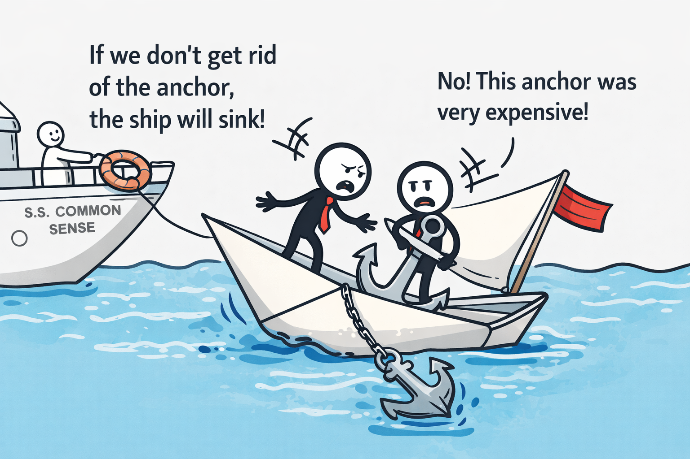

# The Sunk Cost Fallacy

**Category**: decisions
**Detection**: manual
**Short description**: Past investment shouldn't drive future decisions — only expected future value matters.

## Overview

The sunk cost fallacy is a cognitive bias where we let unrecoverable past investments — money, time, effort — drive current decisions. In software, teams routinely push forward with features or products that aren't paying off simply because "we've come this far." Rational decisions require ignoring what you've already spent and evaluating only the expected value from here on.

When a rewrite or a migration to an existing tool will clearly lower future cost, that path should win regardless of what was sunk into the current implementation. The past is data, not debt you owe.

## Takeaways

- Don't stay committed to a decision purely because of prior investment; "we've spent a year on this" is not a reason to spend another.
- Mature teams reassess or kill projects that no longer serve the business; staying the course out of sunk cost usually compounds the loss.
- Set explicit kill criteria up front: "if we don't hit X by end of quarter, we reevaluate or cancel."
- Build a culture where it's safe to admit a project failed without career consequences.

## Examples

A company spent two years building an internal CMS, only to discover it was unreliable and slowed the team down. Even with clear evidence favoring a commercial alternative, leadership hesitated — "two years of work would be wasted." That hesitation is the fallacy at work.

By contrast, Google regularly discontinues underperforming products, and teams that run pre-mortems or frequent retros tend to resist sunk-cost thinking because the "should we kill this?" question is baked into their cadence.

## Signals
- Indirect: old code kept because it was "expensive to write," even when unused.
- Large rewrites delayed repeatedly because "we've already put so much in."

## Scoring Rubric
- ⚪ **Manual**: reflect on the prompts below.

## Reflection Prompts
- Is there a system, feature, or library that you're maintaining mostly because of past investment?
- When was the last time you killed a project mid-flight? How did it go?
- Do you re-evaluate in-progress work against new information, or treat the original plan as locked in?

## Remediation Hints
- Ignore what you've already spent. Ask: "If I were starting today, would I pick this?"
- Decide kill criteria up front so sunk cost doesn't kick in later.

## Origins

The economic notion of sunk costs became prominent in behavioral economics and psychology in the late 20th century. Daniel Kahneman and Amos Tversky investigated the bias in the 1970s, and behavioral economist Richard Thaler formalized the phrase "sunk cost fallacy" around 1980.

## Further Reading

- [The Psychology of Sunk Cost (Arkes & Blumer)](https://www.sciencedirect.com/science/article/abs/pii/0749597885900494)
- [The Sunk Cost Fallacy (The Decision Lab)](https://thedecisionlab.com/biases/the-sunk-cost-fallacy)
- [Thinking, Fast and Slow (Kahneman, book)](https://amzn.to/4sfXfMr)

## Related Laws

- [Occam's Razor](./occam.md)
- [Technical Debt](../quality/tech-debt.md)
- [Second-System Effect](../architecture/second-system.md)
