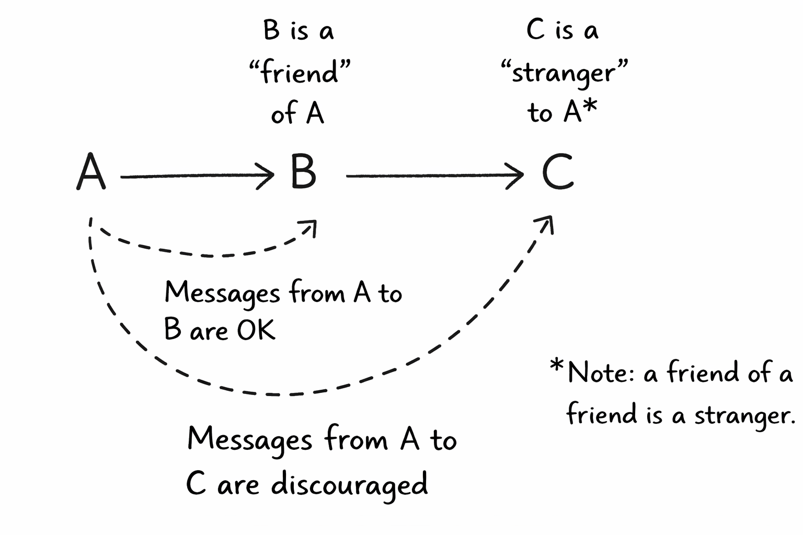

# Law of Demeter

**Category**: design
**Detection**: code
**Short description**: Only talk to your immediate friends — don't reach through chains of collaborators.

## Overview

The Law of Demeter, sometimes called "don't talk to strangers" or the "principle of least knowledge," aims to reduce how much any object knows about the rest of the system. If object A references B, and B references C, then A should not reach through B to call methods on C (for example, `a.getB().getC().doSomething()`). That style tightly couples A to the internal structure of B.

Instead, B should expose a method that does the needed work and hides C behind it. This keeps A isolated from structural details and aligns with information hiding: each object conceals its internals and exposes only the interface its callers need.

## Takeaways

- An object should only call methods on itself, its direct components, its function parameters, or objects it creates. It should not navigate through one object to reach another — "don't talk to strangers."
- If A only talks to its immediate friend B, and doesn't reach into B's collaborators, then changes to those deeper collaborators don't break A. Each class knows as little as possible about the others, so refactors stay local.
- LoD often leads to adding small wrapper or delegation methods. The class gains a few more methods, but interactions become cleaner and changes cheaper.

## Examples

Suppose a `Presenter` holds a reference to a `View` containing a `TextField`. Without LoD, the presenter might call `view.getTextField().setText("Hello")`. Under LoD, the View should expose something like `setUserMessage(String)` and call `textField.setText` internally. The Presenter no longer knows whether the View uses a TextField, a Label, or something else — and if that changes, the Presenter doesn't.

A quick smell test: count the dots. `a.getB().getC().doSomething()` has two chained gets — one too many. `a.doSomething()`, or at most `a.getB().doSomething()`, is usually preferable.

## Signals
- `demeter.deep_chain_4plus`: 4+ chained method calls (`a.b().c().d().e()`).
- `demeter.total_chain_3plus`: 3+ chained calls — a softer indicator.

## Scoring Rubric
- 🟢 **Pass**: deep_chain_4plus == 0, occasional 3-chains only.
- 🟡 **Watch**: deep_chain_4plus 1-10 — some reaching-through.
- 🔴 **Concern**: deep_chain_4plus > 10 — widespread navigation through object graphs.
- ⚪ **Manual**: fluent builder DSLs (SQL query builders, etc.) legitimately chain — judge by context.

## Evidence Format
- Cite deep_chain_4plus count + 2-3 example file:line hits.

## Remediation Hints
- If `a.b().c().d()` is needed often, add a method on `a` that does it (`a.do_the_thing()`).
- Fluent APIs are fine when the chain is explicit domain syntax (builders, query DSLs).
- For business logic: limit to one dot unless you own the chain.

## Origins

The Law of Demeter was first described around 1987 by Ian Holland and colleagues at Northeastern University, as part of the Demeter Project on adaptive and aspect-oriented software. The researchers, including Karl Lieberherr, were searching for rules that made software more maintainable, and summarized the style with the motto "only talk to your friends."

## Further Reading

- [Object-Oriented Programming: An Objective Sense of Style (OOPSLA '88)](https://www2.ccs.neu.edu/research/demeter/papers/law-of-demeter/oopsla88-law-of-demeter.pdf)
- [Law of Demeter - Wikipedia](https://en.wikipedia.org/wiki/Law_of_Demeter)
- [The Paperboy, The Wallet, and The Law Of Demeter](https://www2.ccs.neu.edu/research/demeter/demeter-method/LawOfDemeter/paper-boy/demeter.pdf)
- [Design Patterns: Elements of Reusable Object-Oriented Software](https://amzn.to/3LnM5o6)

## Related Laws

- [SOLID Principles](./solid.md)
- [The Law of Leaky Abstractions](../architecture/leaky-abstractions.md)
- [Hyrum's Law](../architecture/hyrum.md)
- [KISS (Keep It Simple, Stupid)](./kiss.md)
