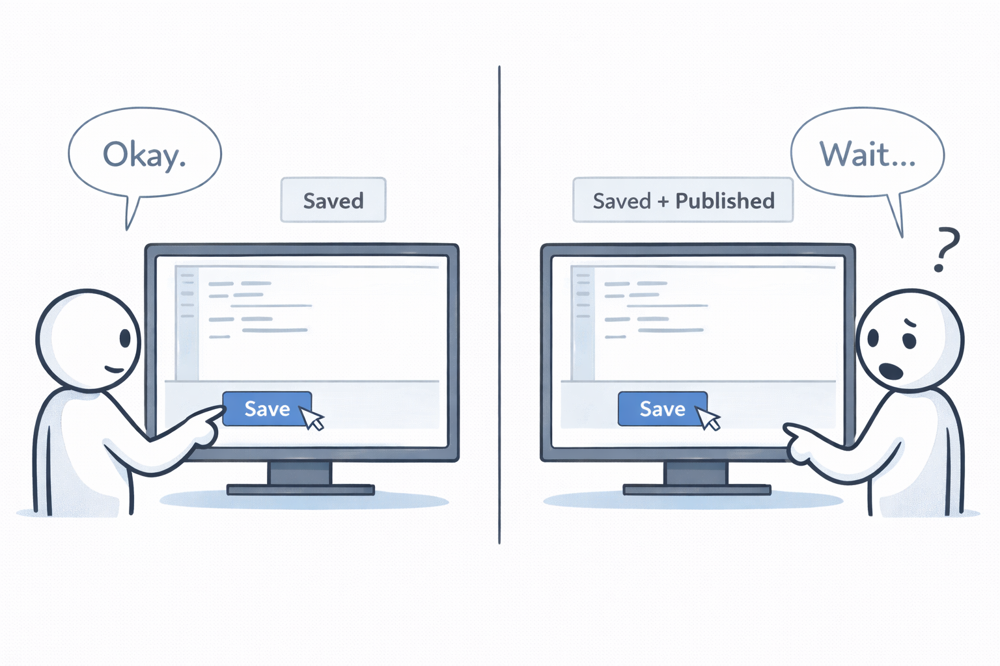

# Principle of Least Astonishment

**Category**: design
**Detection**: code
**Short description**: Components should behave in ways that users and developers expect.

## Overview

The Principle of Least Astonishment (POLA) is a general design principle for UI design, API design, coding, and documentation. The idea is simple: don't surprise the user. The system should behave according to the user's mental model of how it ought to work. Violating POLA doesn't necessarily break functionality, but it breaks trust and ease of use.

Applied to code, POLA means components should behave as a developer expects when reading the name, type, and context. Choose defaults and behaviors that match standard conventions, and avoid unexpected side effects. Surprises are where bugs grow.

## Takeaways

- Design decisions should align with user expectations. When someone uses a component — a UI element, an API, a CLI flag — its behavior should not be surprising or counterintuitive.
- Following platform norms and ecosystem conventions yields the least astonishment. Be boring on purpose.
- Predictability improves usability and developer experience. Users learn faster, developers guess correctly from analogy, and surprises (which lead to mistakes) are minimized.

## Examples

In APIs, a method `deleteFile()` should remove the file. It should not secretly archive it, silently swallow failures, or throw an unexpected error when the file doesn't exist. If your method mirrors a well-known one from another library, keep naming and behavior aligned — a `toString()` method should return human-readable text, not a binary blob.

POLA also covers error handling and defaults. Sensible defaults cause the least surprise. A function `parseDate(str)` that quietly mutates a global date-format setting is deeply surprising. Naming matters too: a variable called `isReady` should be a boolean, a function called `compute` should return a value rather than mutate global state.

## Signals
- `patterns.exit_in_lib`: library code that terminates the process — surprising.
- Function names that lie (`get_user()` that mutates, `is_valid()` that raises, `safe_*` that isn't).
- Side effects inside functions that look pure (constructors making network calls, getters writing to disk).
- Inconsistent naming across modules (camelCase in some files, snake_case in others, mixed).

## Scoring Rubric
- 🟢 **Pass**: consistent naming, predictable side-effect boundaries, no exit-in-lib.
- 🟡 **Watch**: some inconsistency or mild astonishment — a few `exit_in_lib` hits.
- 🔴 **Concern**: repeated surprises: process exits in libs, mutating "getters", mixed casing across neighbors.
- ⚪ **Manual**: astonishment is subjective — needs human review.

## Evidence Format
- Cite `patterns.exit_in_lib` hits + point at any notable lying function names.

## Remediation Hints
- Function names should describe what actually happens. Side-effectful? Say so.
- Follow the conventions of the ecosystem (PEP 8 in Python, standard in Go, etc.) unless there's a strong reason.
- `get_*` = pure read. `fetch_*` / `load_*` = might do IO. `update_*` / `set_*` = mutates.

## Origins

The concept has roots in early human-computer interaction, with an early mention in PL/I documentation around 1967. It was explicitly stated in a 1972 publication on programming language design, recommending that language constructs behave as their syntax suggests and follow widely accepted conventions. It later appears in Eric Raymond's *The Art of Unix Programming* as the "Rule of Least Surprise."

## Further Reading

- [The Art of Unix Programming](https://amzn.to/4q4uTTY)
- [How to Design a Good API and Why it Matters (Bloch)](https://www.youtube.com/watch?v=aAb7hSCtvGw)
- [Principle of Least Astonishment - Wikipedia](https://en.wikipedia.org/wiki/Principle_of_least_astonishment)

## Related Laws

- [Hyrum's Law](../architecture/hyrum.md)
- [KISS (Keep It Simple, Stupid)](./kiss.md)
- [Postel's Law](../quality/postel.md)
- [Law of Demeter](./demeter.md)
