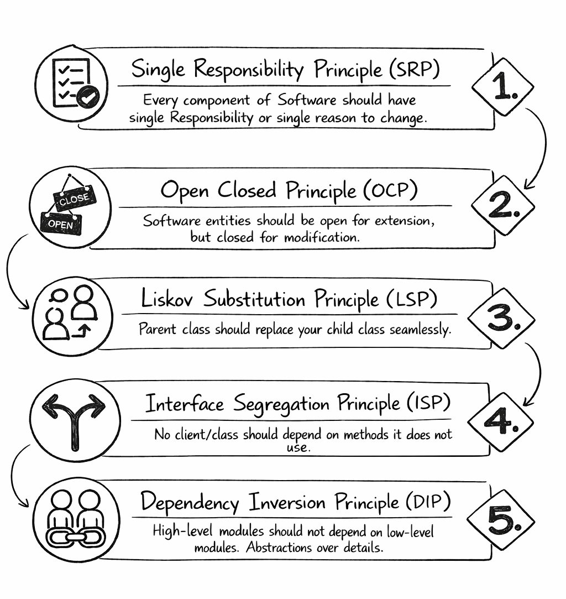

# SOLID Principles

**Category**: design
**Detection**: code
**Short description**: Five OOP design guidelines: Single Responsibility, Open/Closed, Liskov Substitution, Interface Segregation, Dependency Inversion.

## Overview

The SOLID principles are five high-level guidelines for object-oriented design: **Single Responsibility** (one concern per class), **Open/Closed** (open for extension, closed for modification), **Liskov Substitution** (subclasses must be substitutable for their parent), **Interface Segregation** (no forced dependency on unused interface methods), and **Dependency Inversion** (depend on abstractions, not concretions).

Applied together, these guidelines produce systems that are modular, extensible, and robust under change. They make it easier to test, refactor, and extend code without breaking what already works. SOLID does not guarantee a perfect design, but it provides a proven starting point for object-oriented work.

## Takeaways

- Following SOLID makes code easier to extend, test, and refactor without breaking existing functionality. Each principle addresses a different facet of OO design.
- A class with a single responsibility, the right interfaces, correct inheritance relationships, and polymorphic extension points tends to stay maintainable.
- Loose coupling and good encapsulation keep changes localized, preventing cascading failures across the codebase.
- SOLID doesn't guarantee great design — but it provides durable guidelines for getting there.

## Examples

Single Responsibility in action: instead of one `User` class that validates input, talks to the database, sends emails, and logs events, split it into `UserValidator`, `UserRepository`, and `EmailService`, each with one job.

Dependency Inversion: a `NotificationService` should depend on an abstract `NotificationChannel` interface, not on a concrete `EmailSender`. Then swapping SMS for email, or mocking in tests, is trivial.

## Signals
- **SRP**: Large classes doing many things (`complexity` long-file/long-function signals on a single class).
- **OCP**: Modifying existing code (not extending) when adding features — long switch/if-else chains keyed on type.
- **LSP**: Subclasses that override methods to raise `NotImplementedError`/no-op.
- **ISP**: Interfaces with many unrelated methods; classes forced to implement stubs.
- **DIP**: High-level modules importing concrete low-level classes directly (no interface boundary).

## Scoring Rubric
- 🟢 **Pass**: small classes with clear responsibilities; extensions via composition/interfaces.
- 🟡 **Watch**: a few god-classes, some type-checking switch statements, limited use of interfaces.
- 🔴 **Concern**: multiple god-classes, widespread type-switch, no dependency injection, LSP-violating overrides.
- ⚪ **Manual**: non-OOP codebase (functional, procedural) — SOLID applies in spirit, not letter.

## Evidence Format
- Cite largest classes (from `complexity` signals) and any `NotImplementedError` subclass overrides.

## Remediation Hints
- One class, one reason to change.
- Prefer composition over inheritance. Extension via interfaces, not modification.
- Inject dependencies; don't instantiate concrete collaborators inside business logic.

## Origins

Robert C. Martin ("Uncle Bob") collected and popularized the five principles through articles and his 2002 book *Agile Software Development: Principles, Patterns, and Practices*. Michael Feathers coined the acronym "SOLID" around 2004, which gave the set its familiar branding.

## Further Reading

- [Design Principles and Design Patterns (Martin)](https://web.archive.org/web/20150906155800/http://www.objectmentor.com/resources/articles/Principles_and_Patterns.pdf)
- [Agile Software Development: Principles, Patterns, and Practices](https://amzn.to/497oH7H)
- [Clean Architecture](https://amzn.to/4jeeN7k)
- [SOLID - Wikipedia](https://en.wikipedia.org/wiki/SOLID)
- [Design Patterns: Elements of Reusable Object-Oriented Software](https://amzn.to/3LnM5o6)

## Related Laws

- [Law of Demeter](./demeter.md)
- [Hyrum's Law](../architecture/hyrum.md)
- [The Law of Leaky Abstractions](../architecture/leaky-abstractions.md)
- [DRY (Don't Repeat Yourself)](./dry.md)
- [KISS (Keep It Simple, Stupid)](./kiss.md)
- [YAGNI (You Aren't Gonna Need It)](./yagni.md)
