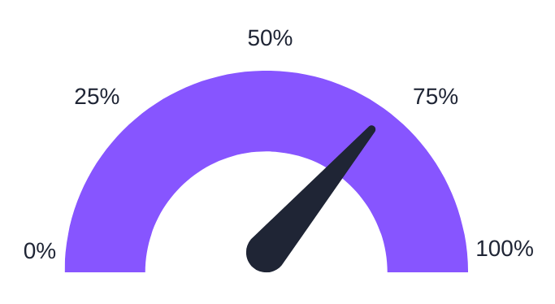

# Gilb's Law

**Category**: planning
**Detection**: manual
**Short description**: Anything you need to quantify can be measured in some way better than not measuring it.

## Overview

Gilb's Law responds to the paralysis that Goodhart's Law can cause. This law asserts that even an approximate or indirect measurement is better than none. When something is essential (performance, customer satisfaction, code maintainability), you should attempt to measure it, because otherwise you have no objective feedback.

Gilb's Law is a good reply to the statement "this aspect is unmeasurable so we won't try." For example, measuring "code quality" is difficult, but you can measure indicators such as cyclomatic complexity, lint warnings, or defect rates as partial indicators. More such indicators can paint the bigger picture.

Those metrics won't be perfect, but Gilb's Law suggests that having them gives you some insight and a starting point for improvement, which is better than having no clue at all.

## Takeaways

- It is better to have some data or metric on a phenomenon than to be completely blind, as long as you understand the metric's limitations.
- In contrast to Goodhart's Law, which warns about misuse of metrics, Gilb's Law reminds us not to throw out metrics entirely.
- Start with a basic measure and refine it over time. The act of measuring helps teams focus and identify trends.
- Even an approximate or indirect measurement is better than none.

## Examples

Measuring developer productivity is notoriously hard (lines of code are poor proxies, story points can be inconsistent). However, you might use deployment frequency or change lead time (as in the DORA metrics for DevOps) as a proxy. They do not capture everything, but they give you actionable data. If deployment frequency decreases, something might be wrong with the pipeline.

Another example is tracking tech debt. No perfect measure of tech debt exists. But tracking things like code complexity scores, incident rates, and developer surveys gives you visibility you would not otherwise have. As Peter Drucker said: "We cannot improve what we do not measure."

## Signals
- Not detectable from code alone. Requires knowing what the team tracks and acts on.

## Scoring Rubric
- ⚪ **Manual**: reflect on the prompts below.

## Reflection Prompts
- What critical qualities (reliability, performance, maintainability) do you currently NOT measure because "it's too hard"?
- When you introduced a new metric, did it improve decisions, or did it just add noise?
- Do you pair each metric with its known limitations so the team doesn't over-index on it?

## Remediation Hints
- Start rough. A bad metric beats no metric IF you're honest about its limits.
- Track a small portfolio of metrics rather than one "north star" — makes gaming obvious.
- Revisit metrics quarterly: are they still useful, or just legacy dashboard clutter?

## Origins

Tom Gilb, a consultant and author on software engineering, formulated this law. It complements his other work on quantifying requirements and using metrics in planning, including Planguage and evolutionary project management.

## Further Reading

- [Tom Gilb - Wikipedia](https://en.wikipedia.org/wiki/Tom_Gilb)
- [Competitive Engineering](https://amzn.to/49AqaT1)
- [DORA Metrics](https://dora.dev/guides/dora-metrics-four-keys/)

## Related Laws

- [Goodhart's Law](../planning/goodhart.md)
- [Parkinson's Law](../planning/parkinson.md)
