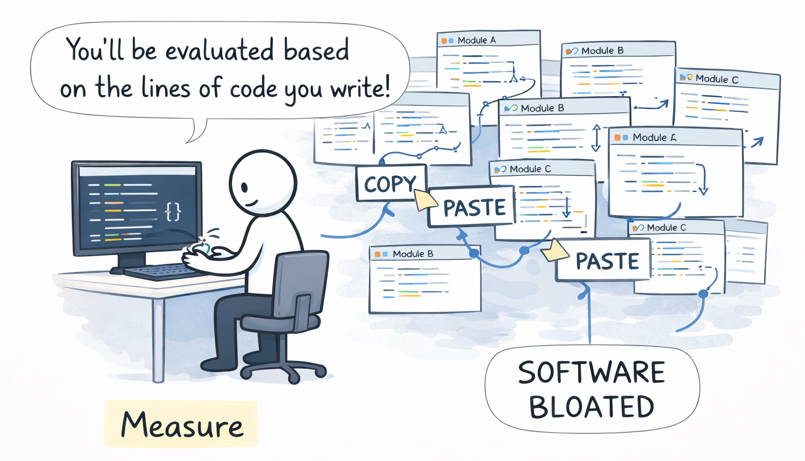

# Goodhart's Law

**Category**: planning
**Detection**: hybrid
**Short description**: When a measure becomes a target, it ceases to be a good measure.

## Overview

"When a measure becomes a target, it ceases to be a good measure." Goodhart's Law comes from economics and applies significantly to software teams. A manager might set a target to "close 100 bug tickets this month," prompting developers to close unresolved tickets or split bugs into multiple entries to inflate numbers. The metric improves while software quality deteriorates, as the metric loses correlation with actual success. Experienced leaders use metrics as indicators rather than targets, always considering broader context.

## Takeaways

- If metrics become goals (lines of code, features closed), people optimize for those metrics rather than underlying value.
- Metrics serve as proxies for what organizations value; as targets, they get met even when undermining original intent.
- Metrics provide useful insight but require contextual use balanced with qualitative judgment.
- Multiple metrics together prevent singular focus that could be manipulated.

## Examples

Software teams rewarded for lines of code wrote verbose, repetitive code violating DRY principles to increase counts, creating bloated software. QA teams measured by test execution count favored easy tests over proper testing, meeting objectives while missing critical bugs. Teams prioritizing code coverage percentages wrote trivial unit tests lacking meaningful assertions while skipping necessary integration tests. Current "tokenmaxxing" practices treat AI token consumption as performance review goals.

## Signals
- `git_evolution.goodhart_hits`: commit messages mentioning "coverage", "metric", "KPI", "SLA target".
- Test files whose only purpose is to raise coverage (asserting trivial truths, no real behavior).
- Scripts that compute/emit metrics with no corresponding alerts or decisions tied to them.
- Feature flags tied to dashboard numbers rather than user outcomes.

## Scoring Rubric
- 🟢 **Pass**: no signs of gaming; tests assert behavior, not coverage.
- 🟡 **Watch**: some "coverage fix" commits or smell of metric-chasing.
- 🔴 **Concern**: consistent pattern of test churn driven by coverage quotas, or a dashboard-per-feature culture.
- ⚪ **Manual**: need to see how leadership rewards these metrics.

## Evidence Format
- Cite `git_evolution.goodhart_hits` and show 1-2 "improve coverage" commits as evidence.

## Remediation Hints
- Target outcomes (bugs escaped, incidents) not proxies (coverage %, LoC written).
- Rotate the metrics you watch so no single one dominates behavior.
- Pair every metric with the decision it is supposed to inform.

## Origins

Named after economist Charles Goodhart, who described this phenomenon regarding monetary policy metrics. Marilyn Strathern later provided the widely-cited phrasing. The concept has been extensively discussed in education and business KPIs, particularly in software engineering where velocity, code coverage, and bug counts become targets.

## Further Reading

- [Goodhart's Law: How Measuring The Wrong Things Drive Immoral Behaviour](https://coffeeandjunk.com/goodharts-campbells-law/)
- [Goodhart's Law - Wikipedia](https://en.wikipedia.org/wiki/Goodhart%27s_law)
- [The Tyranny of Metrics](https://amzn.to/4ji7rzY)
- [Enshittification - Wikipedia](https://en.wikipedia.org/wiki/Enshittification)

## Related Laws

- [Dilbert Principle](../teams/dilbert.md)
- [Parkinson's Law](../planning/parkinson.md)
