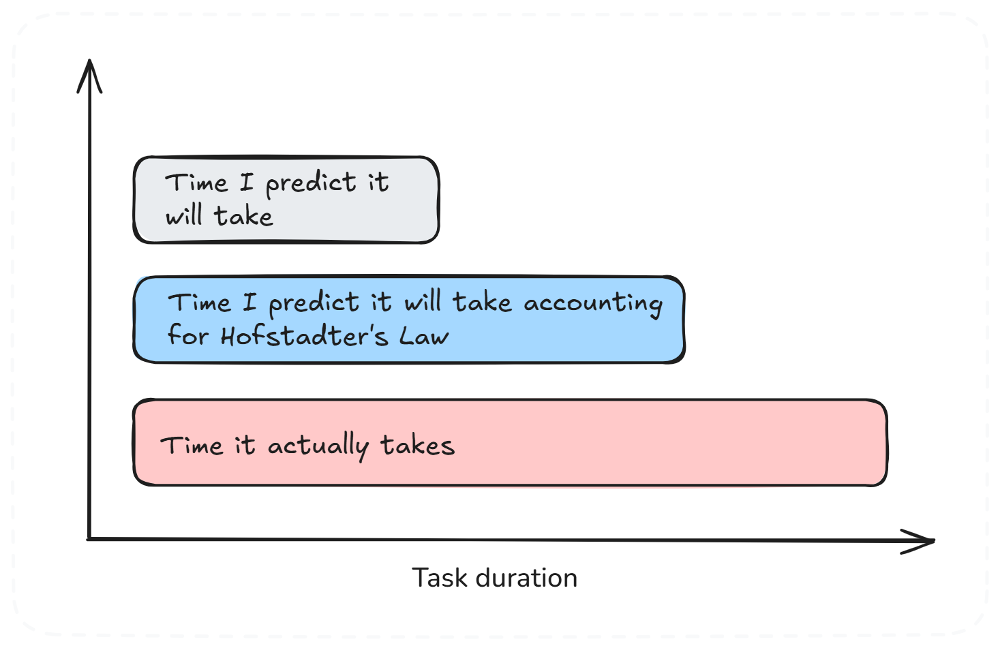

# Hofstadter's Law

**Category**: planning
**Detection**: manual
**Short description**: It always takes longer than you expect, even when you take into account Hofstadter's Law.

## Overview

This recursive law captures the paradox of estimation. No matter how much experience we have, projects tend to run late. The law demonstrates that even accounting for delays, we still underestimate timelines. It highlights uncertainty inherent in complex creative work like software development, where hidden tasks, integration issues, and requirement changes frequently emerge.

## Takeaways

- Humans generally struggle with task estimation accuracy, particularly in complex projects, and continue underestimating despite recognizing this tendency.
- Unknown complexities surface during implementation, extending project timelines beyond initial expectations.
- Schedule contingency buffers prove necessary but are frequently consumed during development.
- Realistic planning requires acknowledging delays as inevitable and adjusting timelines accordingly.

## Examples

A typical scenario involves a team estimating a feature at one month, padding the estimate to six weeks for safety, only to discover it requires three months or longer. Causes include API integration difficulties, team member absences, or failed initial approaches requiring rework. The guideline suggests: complete 2-minute tasks immediately, allocate 1 hour for few-minute tasks, and 1 day for few-hour tasks to maintain adequate scheduling buffer.

## Signals
- Not detectable from code alone. Needs estimate-vs-actual data from a planning tool.

## Scoring Rubric
- ⚪ **Manual**: reflect on the prompts below.

## Reflection Prompts
- On your last 5 features, what was the estimate vs actual delivery ratio?
- Do you add a buffer to estimates, or refuse to? How's that working?
- When a task is "almost done," how often is "almost" ≤ 20% of remaining time?

## Remediation Hints
- Track estimate vs actual in a spreadsheet. The average multiplier is your honest estimator.
- Break work into pieces of ≤2 days — the variance compounds less.
- Budget recursively: "It'll take a week" → "So plan for 2 weeks" → actually 3.

## Origins

Douglas Hofstadter introduced this concept in 1979 through *Gödel, Escher, Bach: An Eternal Golden Braid*, exploring recursion and self-reference themes. Fred Brooks made a comparable observation in *The Mythical Man-Month* stating that tasks require more time than anticipated. The principle has become widespread among developers through collective project experience.

## Further Reading

- [Gödel, Escher, Bach: An Eternal Golden Braid](https://amzn.to/4jjKSLl)
- [The Mythical Man-Month](https://amzn.to/49cAqQO)
- [Why Software Projects Take Longer Than You Think](https://erikbern.com/2019/04/15/why-software-projects-take-longer-than-you-think-a-statistical-model.html)

## Related Laws

- [Parkinson's Law](../planning/parkinson.md)
