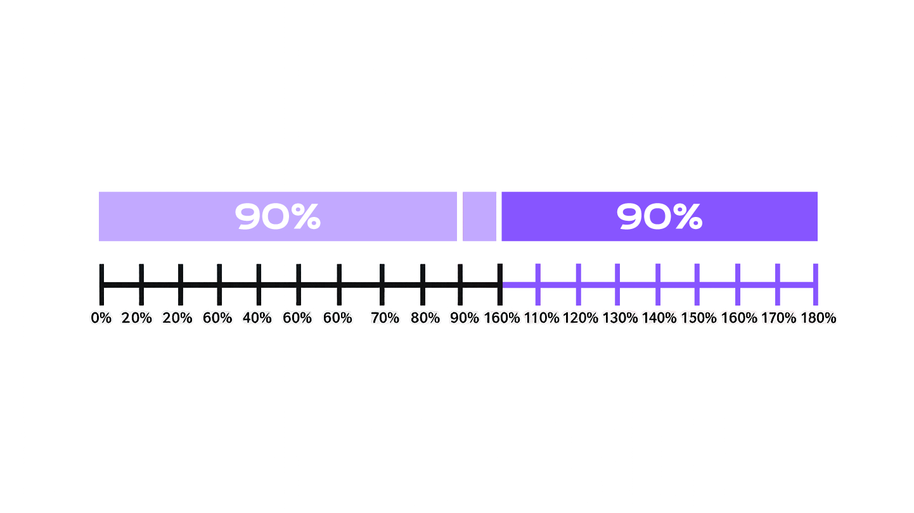

# The Ninety-Ninety Rule

**Category**: planning
**Detection**: hybrid
**Short description**: The first 90% of the code takes 90% of the time; the remaining 10% takes the other 90%.

## Overview

This rule quantifies the extent to which projects get stuck in the final phase. Often, teams make good progress at the start, building core functionality, which leads to optimism. Then integration, corner cases, performance tuning, and bug fixing consume an unexpectedly large amount of time, often equal to or greater than what has already been spent.

In practical terms, this rule advises that the last bit of a project is not a small bit. You should plan for a significant effort in finishing, polishing, and delivering.

It is also related to Hofstadter's Law, as it is another way our estimates fall short. We do not realize how hard that last leg is.

## Takeaways

- The final parts of a project (polishing, edge cases, integration, bug fixes) often take far more effort than anticipated, often as much as the initial development.
- What looks like the "finishing touches" involves many tricky problems and unknowns.
- Reaching a "mostly done" state can create optimism, but the rule warns that "almost done" often means only halfway in terms of time.

## Examples

A team develops a new app. In three months, the core features are done, and they hit "90% of the functionality." Everyone expects to ship in one more month. Instead, integration testing reveals that multiple modules do not talk correctly, specific edge inputs crash the app, memory usage is too high. That final "10%" takes another three months.

When implementing a new website, you get a basic version up quickly (login, basic pages). The last bits: cross-browser fixes, responsive design adjustments, accessibility improvements, writing tests, and performance improvements seem like 10% of the work, but they take as much time as the main coding.

## Signals
- `todos.tag_counts.TODO` + `FIXME` density (especially in recently-added code).
- Files with feature-complete names but `TODO: error handling`, `TODO: edge cases`, `TODO: tests` inside.
- `test_ratio.test_to_source_ratio` very low alongside new feature code.

## Scoring Rubric
- 🟢 **Pass**: low TODO density in new code; tests and error handling land with features.
- 🟡 **Watch**: moderate TODOs scoped to "polish" concerns (logging, edge cases).
- 🔴 **Concern**: high TODO density concentrated in recently-added files (features shipping incomplete).
- ⚪ **Manual**: true "finishability" requires product/UX judgment.

## Evidence Format
- Point at the densest TODO file with `file:line` and note what's deferred.

## Remediation Hints
- Define "done" up front: tests + errors + docs + observability, not just "happy path works."
- Budget the last 10% explicitly; don't treat it as free.
- Freeze scope when the polish tail starts growing faster than the feature tail.

## Origins

Credited to Tom Cargill of Bell Labs, and popularized by Jon Bentley's September 1985 "Bumper-Sticker Computer Science" column in Communications of the ACM. It was originally called the "Rule of Credibility", a name which did not stick.

## Further Reading

- [Programming Pearls - Bumper Sticker Computer Science](https://moss.cs.iit.edu/cs100/Bentley_BumperSticker.pdf)
- [Programming Pearls (Book)](https://amzn.to/49bLHkn)
- [Ninety-Ninety Rule - Wikipedia](https://en.wikipedia.org/wiki/Ninety%E2%80%93ninety_rule)
- [Identifying and Mitigating the Ninety-Ninety Rule in Software Development](https://dev.to/ben/identifying-and-mitigating-the-ninety-ninety-rule-in-software-development-4ap3)

## Related Laws

- [Hofstadter's Law](../planning/hofstadter.md)
- [Parkinson's Law](../planning/parkinson.md)
- [Pareto Principle (80/20 Rule)](../decisions/pareto.md)
