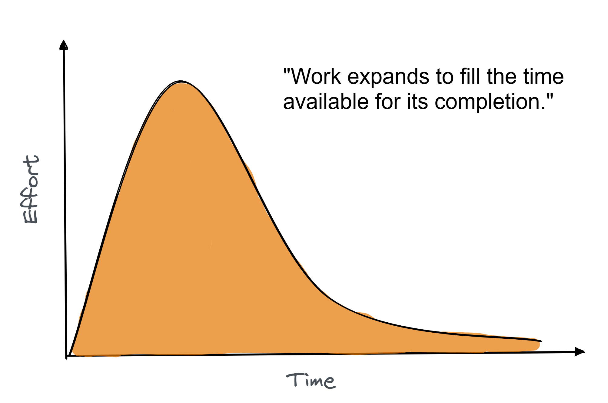

# Parkinson's Law

**Category**: planning
**Detection**: hybrid
**Short description**: Work expands to fill the time available for its completion.

## Overview

This law shows a common problem with time management among developers. If a developer is given two weeks to complete a task that could be done in two days, the work will usually slow down, consuming most of that time.

The principle indicates that loose deadlines reduce productivity, so teams should establish clear, realistic time limits. However, managers must balance this insight with practical scheduling considerations, as overly compressed timelines risk triggering Hofstadter's Law.

## Takeaways

- If you give a task an overly long timeline, people tend to use all of it (or procrastinate until the last minute), so the task takes as long as the deadline allows.
- Giving more time, teams often do polishing (gold-plating) or add minor improvements that aren't strictly necessary, just to use the whole time allotted for the task.
- A bit stronger (but realistic) deadlines can counteract Parkinson's Law by having a sense of urgency (called deadline-driven development).

## Examples

A developer assigned to write a module with "Take as long as you need, maybe a month or two" will likely delay finishing, experimenting with multiple implementations or polishing non-essential items. The same task with a one-week deadline might be completed within that timeframe.

Agile teams apply this principle through time-boxing tasks. Similarly, all-day meetings typically consume their full duration, whereas two-hour windows encourage focused completion.

## Signals
- `git_evolution` commit-subject tokens "estimate", "eta", "deadline" appearing repeatedly.
- Long-lived feature branches with many small commits (`hotspots` showing high churn on a single sub-tree over months).
- Commits adding goldplating features right before release milestones (only detectable with external milestone data).

## Scoring Rubric
- 🟢 **Pass**: short-lived branches (<2 weeks), tight PRs, few "deadline" mentions.
- 🟡 **Watch**: a handful of long-running branches, occasional estimate drift.
- 🔴 **Concern**: multiple branches active >1 month each, repeated estimate-related commit churn.
- ⚪ **Manual**: need external planning data (Jira, Linear) to confirm.

## Evidence Format
- Cite `git_evolution.estimate_hits` + branch age sampled via `git branch --list --sort=-committerdate`.

## Remediation Hints
- Timebox exploration; ship narrow slices instead of "one big release."
- Set deadlines shorter than feels comfortable and cut scope to meet them.
- Kill the "polish phase" — merge and iterate in production.

## Origins

Parkinson's Law was first described in an essay by Cyril Parkinson, published in The Economist in 1955, which initially described how bureaucracies expand over time. The principle has since become foundational in project management discourse.

## Further Reading

- [Parkinson's Law (Original Essay)](https://www.economist.com/news/1955/11/19/parkinsons-law)
- [Parkinson's Law: The Book](https://amzn.to/4jg0OOD)
- [Parkinson's Law - Wikipedia](https://en.wikipedia.org/wiki/Parkinson%27s_law)

## Related Laws

- [Hofstadter's Law](../planning/hofstadter.md)
- [Brooks's Law](../teams/brooks.md)
