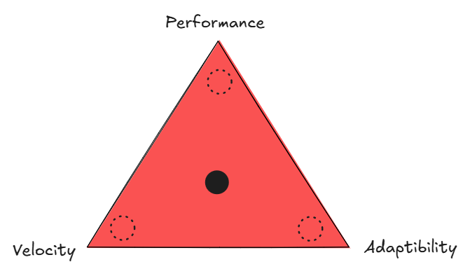

# Premature Optimization

**Category**: planning
**Detection**: hybrid
**Short description**: "Premature optimization is the root of all evil" — Knuth.

## Overview

Knuth's Optimization Principle captures a fundamental trade-off in software engineering: performance improvements often increase complexity. Applying optimization before identifying actual performance bottlenecks creates unnecessarily complex systems. Early development should prioritize clear design. Premature optimization risks introducing bugs and inflexibility to accelerate code sections that may not even be performance-critical. Research suggests approximately 20% of code consumes 80% of execution time. The principle recommends writing straightforward code first, then profiling and enhancing only genuinely critical sections.

## Takeaways

- Most code doesn't run in performance-critical hotspots, so obsessing over micro-optimizations everywhere wastes time and makes code harder to read and maintain.
- According to Knuth, we should forget about small efficiencies about 97% of the time, and focus on clean design and correct functionality.
- Optimized code is often more complex or less readable. If done prematurely, you incur this cost even when it's unnecessary.
- Get it working correctly first, then make it fast, then make it pretty.

## Examples

A developer spent two days writing complex bit-manipulation code to enhance speed, only discovering the function executes once at startup, consuming 0.001% of runtime. The effort proved wasteful while adding code complexity. Meanwhile, an actual bottleneck (a sorting function processing large datasets) remained unoptimized.

Alternatively, choosing an intricate data structure prematurely for theoretical efficiency (custom tree for log(N) lookups) can be unnecessary when simpler approaches suffice. Following Knuth's guidance means implementing simply, measuring results, then optimizing identified bottlenecks.

## Signals
- Complex, non-obvious code (`complexity` signals) paired with no corresponding benchmark files or perf tests.
- Heavy use of low-level primitives (manual bit-twiddling, unsafe, SIMD, `@lru_cache` everywhere) without measured hotspots.
- Commit messages mentioning "optimize" / "performance" on code that isn't on any measured critical path.

## Scoring Rubric
- 🟢 **Pass**: complex code exists only where benchmarks or profiling justify it.
- 🟡 **Watch**: some hand-optimized functions lack benchmarks or perf comments.
- 🔴 **Concern**: widespread micro-optimizations without any benchmark directory or profiling evidence.
- ⚪ **Manual**: judgement requires knowing which code is hot in production.

## Evidence Format
- File:line of notable hand-optimized code + absence of matching benchmark file.

## Remediation Hints
- Measure first: add benchmarks or a profiler run for anything you optimize.
- Prefer clear code until profiling proves you need clever code.
- Document perf invariants in a comment adjacent to the clever section.

## Origins

Donald Knuth, a legendary computer scientist, made this statement in his 1974 paper "Structured Programming with Go To Statements" published in ACM Computing Surveys. The complete quote provides context: "We should forget about small efficiencies, say about 97% of the time: premature optimization is the root of all evil. Yet we should not pass up our opportunities in that critical 3%." The phrase resonated throughout software engineering culture, becoming a principle taught to junior developers.

## Further Reading

- [Structured Programming with go to Statements](https://pic.plover.com/knuth-GOTO.pdf)
- [Code Complete](https://amzn.to/4b6YVBx)
- [Program Optimization - Wikipedia](https://en.wikipedia.org/wiki/Program_optimization)

## Related Laws

- [YAGNI (You Aren't Gonna Need It)](../design/yagni.md)
- [Hofstadter's Law](../planning/hofstadter.md)
- [Gall's Law](../architecture/gall.md)
- [Kernighan's Law](../quality/kernighan.md)
- [Amdahl's Law](../scale/amdahl.md)
