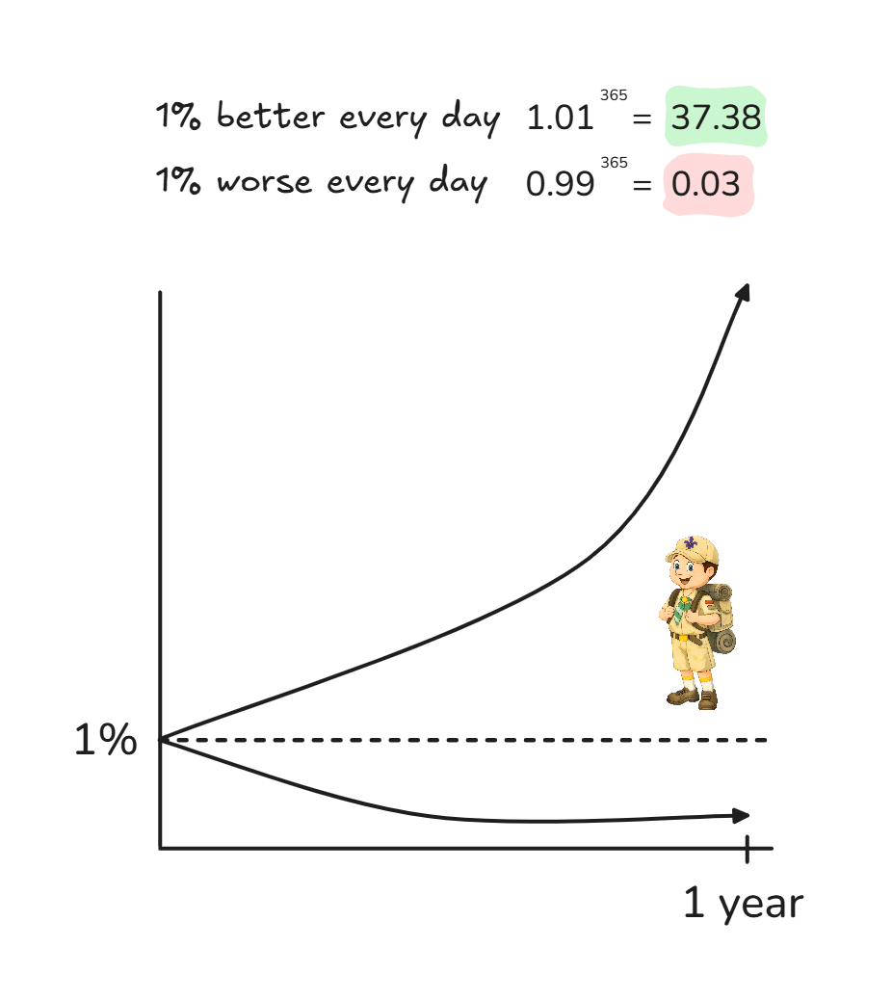

# The Boy Scout Rule

**Category**: quality
**Detection**: git-history
**Short description**: Always leave the code a little better than you found it.

## Overview

The Boy Scout Rule is a software development practice centered on the principle: leave the code better than you found it. Rather than pursuing major rewrites, it emphasizes consistent, incremental improvements. Developers are encouraged to polish code nearby whenever they encounter it — whether adding features or fixing bugs — through actions like renaming unclear functions, refactoring duplicated code, or adding missing tests. These modest changes accumulate significantly over time.

Google's practice embodies this spirit: "If you touch it, you own it," meaning developers take responsibility for code quality during any modification, addressing minor issues alongside unrelated tasks.

## Takeaways

- Don't allow poor code to deteriorate; spend a few moments refactoring or fixing small things in your working area, from variable names to logic simplification.
- A cleaner codebase enhances readability, maintainability, and reduces technical debt.
- When universally practiced, this rule cultivates collective code ownership and team accountability for quality standards.

## Examples

A developer enhancing an older module notices a 200+ line `processData()` function and commented-out blocks. Following the rule, they decompose the function into smaller, clearly-named functions and remove the obsolete comments as part of their feature work. Google's engineers routinely address minor issues during unrelated tasks, resulting in thousands of accumulated cleanups that prevent larger problems later.

## Signals
- Proxy: hotspot files whose complexity/LOC have grown over time (`hotspots` signals showing high-churn + growing size).
- Commits that add features without removing any dead code or fixing any adjacent issues.
- TODO/FIXME counts increasing over time rather than decreasing.

## Scoring Rubric
- 🟢 **Pass**: hotspot files show stable or shrinking LOC over time; refactor commits interleave with feature commits.
- 🟡 **Watch**: hotspot files mostly grow; occasional cleanup commits visible.
- 🔴 **Concern**: hotspots grow monotonically; no refactor commits in the last 100.
- ⚪ **Manual**: not a git repo, or too young to judge.

## Evidence Format
- Point at top hotspot with its growth trajectory; count "refactor" / "cleanup" in recent commit subjects.

## Remediation Hints
- When you open a file for feature work, spend 10% of the edit budget on nearby cleanup.
- Lint/format on save so the trivial stuff is automatic.
- Track "technical debt paid down" as a first-class PR type.

## Origins

"Leave the campsite cleaner than you found it" originated with Boy Scouts of America and global Scouting organizations. Robert C. Martin ("Uncle Bob") popularized the Boy Scout Rule in software development through his 2008 book *Clean Code: A Handbook of Agile Software Craftsmanship*, observing that continuous small improvements transform codebases more effectively than rare large refactoring projects.

## Further Reading

- [Clean Code (Robert C. Martin)](https://amzn.to/3LjRFYI)
- [The Boy Scout Rule (97 Things Every Programmer Should Know)](https://www.oreilly.com/library/view/97-things-every/9780596809515/ch08.html)
- [Refactoring: Improving the Design of Existing Code (Fowler)](https://martinfowler.com/books/refactoring.html)
- [Code Complete (McConnell)](https://amzn.to/3N57T8t)

## Related Laws

- [Broken Windows Theory](./broken-windows.md)
- [YAGNI](../design/yagni.md)
- [Technical Debt](./tech-debt.md)
