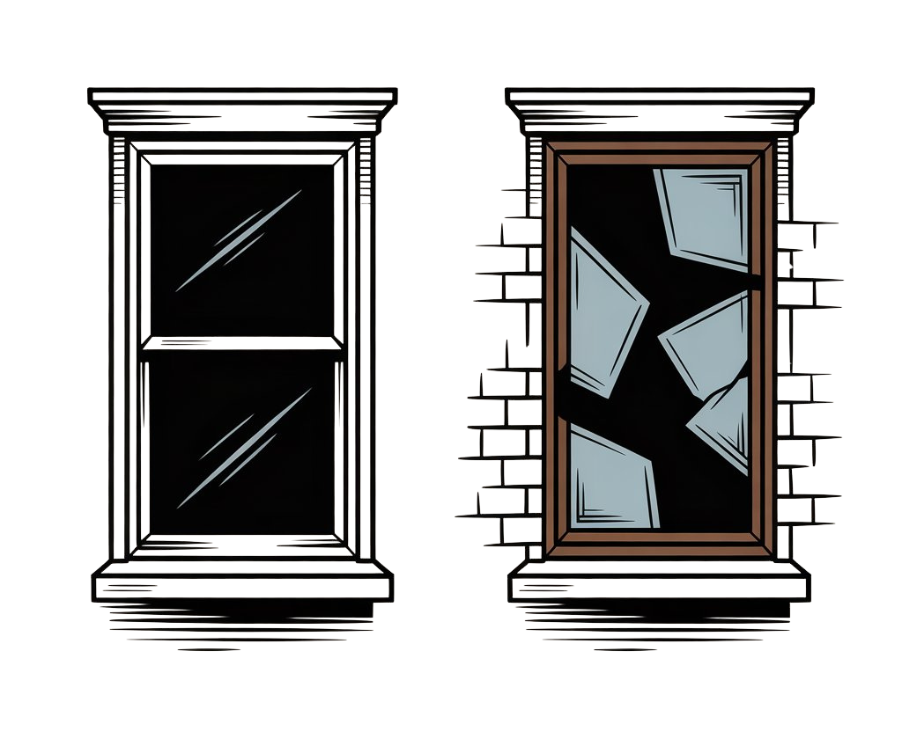

# Broken Windows Theory

**Category**: quality
**Detection**: code
**Short description**: Neglect signals more neglect — visible disrepair invites further decay.

## Overview

The Broken Windows Theory in software was popularized by *The Pragmatic Programmer*. Drawing from criminology, the principle suggests that unrepaired code problems signal neglect and invite further degradation. When teams ignore failing tests, tolerate messy sections, or leave bugs unaddressed, developers receive a message that quality standards don't matter, and that accelerates what's known as software entropy.

Conversely, maintaining high standards and promptly addressing minor issues creates a culture where developers remain conscientious about code quality. The codebase itself becomes a norm-setting artifact.

## Takeaways

- Minor bugs and poor style left unaddressed signal that quality is unimportant, encouraging messier contributions.
- Well-maintained codebases promote continued cleanliness; chaotic ones encourage corner-cutting.
- Address problems while small — refactor problematic code and update outdated documentation to prevent deterioration.

## Examples

Teams have observed that unresolved `// TODO` comments and untested modules invite similar shortcuts from other developers. Conversely, projects with aggressive maintenance of code style and active technical debt reduction see fewer new bugs, as developers internalize the higher standards through contribution.

## Signals
- `todos.per_kloc`: high TODO/FIXME density.
- `complexity`: large/long-nested files unrefactored.
- `duplication`: many duplicated blocks untouched.
- `patterns.silent_exceptions`: normalized error-swallowing.
- Commented-out code blocks left in place.

## Scoring Rubric
- 🟢 **Pass**: low TODO density, clean complexity metrics, no commented-out code.
- 🟡 **Watch**: moderate TODO density, a few large/duplicated files, some dead code.
- 🔴 **Concern**: high TODO density AND significant complexity/duplication issues AND signs of normalized sloppiness.
- ⚪ **Manual**: very small repo.

## Evidence Format
- Combine signals: "N TODOs + M long functions + K duplicated blocks + P silent excepts."

## Remediation Hints
- Fix one broken window per PR as you pass through.
- Enforce linting + formatting in CI — raise the floor.
- Delete commented-out code; git remembers.

## Origins

The theory originates from criminology research by James Q. Wilson and George Kelling (1982). Andy Hunt and Dave Thomas applied it to software in *The Pragmatic Programmer* (1999), advocating for prompt fixes to minor issues before they signal that decay is acceptable.

## Further Reading

- [The Broken Window Theory (Coding Horror)](https://blog.codinghorror.com/the-broken-window-theory/)
- [Broken Windows Theory (Wikipedia)](https://en.wikipedia.org/wiki/Broken_windows_theory)
- [The Pragmatic Programmer](https://amzn.to/4qygIq6)
- [Joy of Programming: The Broken Window Theory](https://opensourceforu.com/2011/05/joy-of-programming-broken-window-theory/)

## Related Laws

- [Technical Debt](./tech-debt.md)
- [The Boy Scout Rule](./boy-scout.md)
- [Gall's Law](../architecture/gall.md)
