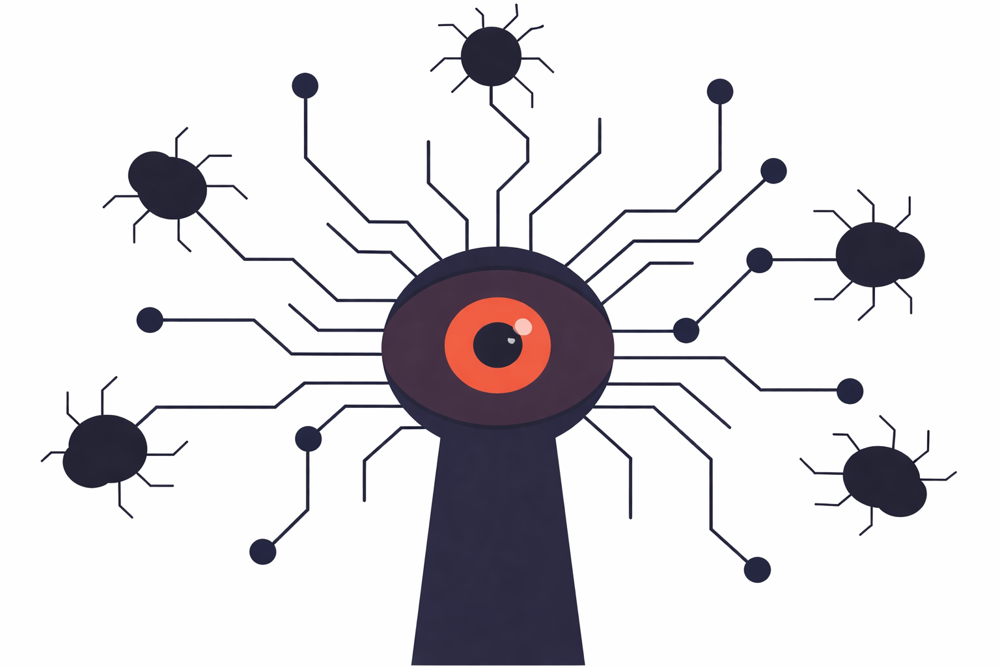

# Linus's Law

**Category**: quality
**Detection**: git-history
**Short description**: Given enough eyeballs, all bugs are shallow.

## Overview

Linux's open development model, with frequent public releases, enables rapid bug detection. When many people use and examine software, issues become apparent to someone. A bug that is perplexing to one programmer might be trivial for another with different expertise; among thousands of users, someone will discover the exact reproduction steps while another submits a fix.

The principle demonstrates the fundamental value of open source: transparency and collaboration lead to more robust, reliable software. It is not absolute — coordination and quality control are still required, and the "eyeballs" must actually be engaged for the effect to work. Open-source status alone does not automatically resolve bugs.

## Takeaways

- Peer review and community size are force multipliers in software development. With a large, engaged pool of contributors, someone will eventually have the expertise to find and fix any given bug.
- Open-source is frequently cited as benefiting from this law because publicly available source accumulates many readers. Proprietary software with few customers lacks the same pressure.
- The law assumes eyeballs that are actively looking. Dormant or disengaged communities do not deliver the effect; an open repo with no readers is just a lonely repo.

## Examples

The Apache HTTP Server, used by millions, benefits from open code and a vast user base that debugs and improves it. Log4Shell was ultimately identified and patched by the broader community, despite being overlooked for years.

Contrast this with proprietary enterprise software shipped to a handful of clients: a subtle bug might only be noticed by the vendor's small team and a few implementers, taking considerably longer to surface and resolve because the pool of eyeballs is tiny.

## Signals
- `git_evolution.unique_authors`: more authors → more eyeballs.
- `git_evolution.merge_ratio`: high merge ratio suggests PR-based review.
- `bus_factor.bus_factor > 1`: no single point of knowledge.
- Presence of `.github/CODEOWNERS` or similar review-enforcement.

## Scoring Rubric
- 🟢 **Pass**: ≥5 authors, ≥10% merges, CODEOWNERS or similar visible.
- 🟡 **Watch**: 3-5 authors, some merge commits.
- 🔴 **Concern**: ≤2 authors with no merge-PR pattern — no review happening.
- ⚪ **Manual**: solo project, or review happens off-git.

## Evidence Format
- `unique_authors`, `merge_ratio`, presence of `.github/CODEOWNERS`.

## Remediation Hints
- Require PR review. One reviewer minimum, two for risky areas.
- Rotate reviewers; don't let the same pair own review forever.
- Open-source (or at least cross-team share) high-risk modules.

## Origins

Named after Linux creator Linus Torvalds, the law was formulated by Eric S. Raymond in the late 1990s. In his essay "The Cathedral and the Bazaar," Raymond wrote: "Given enough eyeballs, all bugs are shallow," honoring Torvalds' open development methodology. The essay, inspired by watching hundreds of kernel debuggers around the world, was first presented in 1997 and published as a book in 1999.

## Further Reading

- [The Cathedral and the Bazaar](https://amzn.to/49cYD9Y)
- [Linus's Law - Wikipedia](https://en.wikipedia.org/wiki/Linus%27s_law)
- [With Enough Eyeballs, All Bugs Are Shallow - TechCrunch](https://techcrunch.com/2012/02/23/with-many-eyeballs-all-bugs-are-shallow/)
- [Revisiting Linus's Law: Benefits and Challenges of OSS Peer Review](https://www.sciencedirect.com/science/article/abs/pii/S1071581915000087)
- [An Empirical Study of Build Maintenance Effort - IEEE](https://www.computer.org/csdl/magazine/mi/2012/01/mmi2012010072/13rRUzphDuy)
- [Timeline of the xz open source attack](https://research.swtch.com/xz-timeline)

## Related Laws

- [Brooks's Law](../teams/brooks.md)
- [Sturgeon's Law](./sturgeon.md)
- [Bus Factor](../teams/bus-factor.md)
