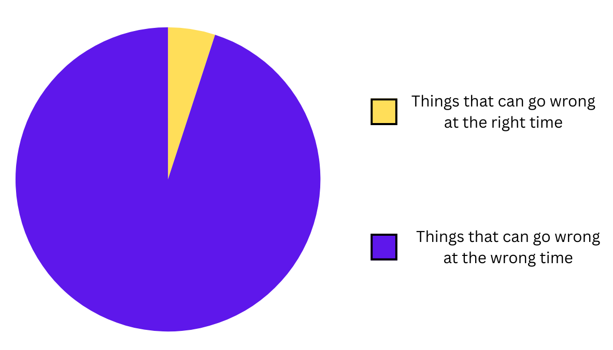

# Murphy's Law

**Category**: quality
**Detection**: code
**Short description**: Anything that can go wrong will go wrong.

## Overview

In software development, Murphy's Law describes how whatever can go wrong in code — a null pointer, a race condition, a network outage — eventually will manifest, especially in large user bases or at the worst possible time. The principle encourages developers to adopt defensive coding practices, including null checks, exception handling, and input validation.

DevOps teams apply this concept by implementing monitoring, enabling rollbacks, and maintaining contingency plans. The operational posture assumes failure is inevitable and prepares for it, rather than assuming things will work and scrambling when they don't.

## Takeaways

- If an error can happen, it will happen. Plan and code defensively with this in mind.
- Add error handling, backups, and checks.
- Edge cases will occur in production. Write tests for those scenarios.

## Examples

- Web form fields accepting unexpectedly long or malformed input strings without validation.
- Memory exhaustion occurring when multiple processes align unfavorably.
- The Windows 98 Bill Gates live demo crash — a famous real-world instance.
- Functions that assume input files exist when they may be missing or corrupted.
- Critical server failures that happen during the on-call engineer's downtime.

## Signals
- `patterns.silent_exceptions`: bare excepts / empty catch blocks — errors are being hidden.
- `patterns.infinite_timeouts`: unbounded waits.
- `test_ratio.test_to_source_ratio < 0.2`: insufficient tests to catch the "will go wrong."
- Critical operations (DB writes, external calls) without error paths.

## Scoring Rubric
- 🟢 **Pass**: explicit error handling at boundaries, tests cover failure modes, no silent exceptions.
- 🟡 **Watch**: some silent exceptions or missing timeouts, but most error paths covered.
- 🔴 **Concern**: 10+ silent exceptions, missing timeouts everywhere, happy-path-only code.
- ⚪ **Manual**: prototype/experiment code where error handling is deliberately deferred.

## Evidence Format
- Cite `patterns.silent_exceptions`, infinite-timeout file:line, missing test coverage.

## Remediation Hints
- Never swallow exceptions without logging + a reason. At minimum: `except X: log.warning("why")`.
- Every external boundary: timeout, retry, error mapping.
- Write a failure-case test for every new branch you add.

## Origins

Attributed to Edward A. Murphy Jr., an engineer working on rocket sled experiments in 1949. The principle gained prominence in aerospace before spreading throughout software development as a shorthand reminder that untested scenarios will inevitably be discovered by users — usually at the worst possible moment.

## Further Reading

- [Murphy's Law (Wikipedia)](https://en.wikipedia.org/wiki/Murphy%27s_law)
- [Windows 98 Crash During Live Demo](https://www.youtube.com/watch?v=yeUyxjLhAxU)
- [Defensive Programming (Wikipedia)](https://en.wikipedia.org/wiki/Defensive_programming)
- [CrowdStrike Channel File 291 RCA Exec Summary](https://www.crowdstrike.com/falcon-content-update-remediation-and-guidance-hub/)

## Related Laws

- [Confirmation Bias](../decisions/confirmation-bias.md)
