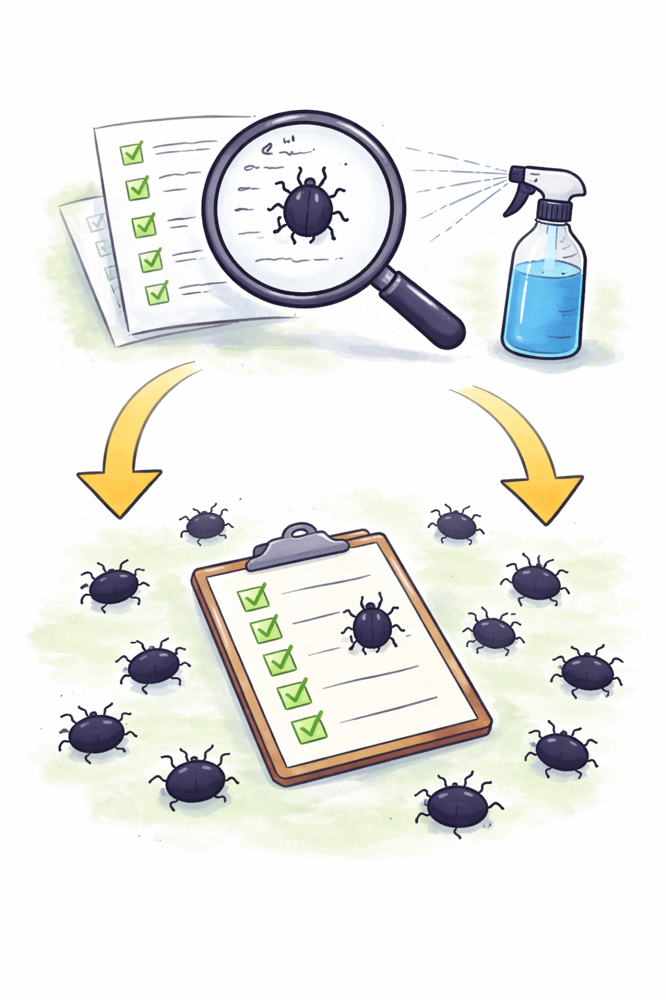

# The Pesticide Paradox

**Category**: quality
**Detection**: git-history
**Short description**: The same tests run repeatedly stop finding new bugs.

## Overview

The Pesticide Paradox draws an analogy from agriculture: when the same pesticide is used repeatedly, pests develop resistance to it. In software testing, initial runs may identify many bugs that get fixed, but repeatedly running the same unchanged tests won't catch new defects — the software becomes "immune" to that specific suite.

The testing process therefore requires continuous evolution. Test cases need regular maintenance, and after each release cycle, teams should review production incidents and update the suite accordingly. The paradox also supports exploratory testing, where testers probe the system in novel ways to uncover issues a static regression suite would miss.

## Takeaways

- Over time, an outdated test suite identifies fewer bugs. The tests are still useful as regression anchors, but no longer effective at detecting new defects.
- The paradox illustrates the need to continuously infuse new test data and new scenarios. Testers must not become complacent with their existing scripts.
- By periodically creating new tests or mutating existing ones, you effectively "refresh the pesticide" and create opportunities to catch fresh bugs.

## Examples

A mobile app team initially created extensive login and user profile tests, finding ten bugs. Later releases passed those tests cleanly, so the team assumed quality was fine. But a newly added messaging feature lacked adequate test coverage. Within a couple of releases, complaints started trickling in about the messaging feature crashing. Once messaging tests were added, issues began being caught before release.

The pattern generalizes: new features arrive, but tests only cover the old ones. Bug density shifts to wherever the tests aren't looking.

## Signals
- `test_ratio` stale-test signals (tests unchanged in >1 year while source they cover keeps changing).
- Test files whose last modification predates most of the code they target.
- Absence of fuzz/property testing or mutation testing.

## Scoring Rubric
- 🟢 **Pass**: tests evolve alongside code; some property-based or fuzz testing present.
- 🟡 **Watch**: most tests are older than the code; no fuzz/mutation testing.
- 🔴 **Concern**: 5+ stale test files identified + no new test types introduced in >1 year.
- ⚪ **Manual**: tests kept up-to-date in a separate repo.

## Evidence Format
- List stale test files with ages.

## Remediation Hints
- Add property-based or fuzz tests for complex input surfaces.
- Periodically rotate test emphasis — different suites for different concerns.
- Mutation testing (e.g., mutmut, Stryker) to validate your tests still catch bugs.

## Origins

The concept was articulated by Dr. Boris Beizer, a software testing expert, and became widely known as one of the "seven principles of testing" in ISTQB (International Software Testing Qualifications Board) materials.

## Further Reading

- [Software Testing Techniques (Beizer)](https://amzn.to/3Yg3jH4)
- [ISTQB Foundation Level Syllabus](https://www.istqb.org/certifications/certified-tester-foundation-level)
- [Lessons Learned in Software Testing](https://amzn.to/3YNqIzD)

## Related Laws

- [Lehman's Laws of Software Evolution](../addenda/lehman.md)
- [Testing Pyramid](./testing-pyramid.md)
