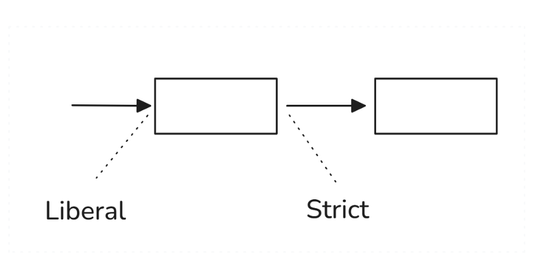

# Postel's Law (Robustness Principle)

**Category**: quality
**Detection**: code
**Short description**: Be conservative in what you send, be liberal in what you accept.

## Overview

Postel's Law states: be conservative in what you do, be liberal in what you accept from others. When systems emit data or interact externally, they should strictly adhere to protocols and standards. Conversely, when receiving data, systems should handle variations and minor errors gracefully rather than rejecting communication outright. This principle fostered Internet resilience by enabling different implementations to communicate through mutual compatibility efforts.

The law applies broadly — consider file readers. A robust XML parser might recover from minor errors, whereas a strict parser would refuse the file entirely. However, excessive tolerance creates trade-offs: overly liberal acceptance can mask producer errors and create long-term interoperability problems if vendors never fix bugs. Modern security thinking has pushed back on the "liberal" half somewhat for this reason.

## Takeaways

- When emitting data, strictly follow protocols and standards.
- When receiving data, handle variations and minor errors where safely possible.
- Modern security considerations sometimes temper this principle to prevent masked errors.

## Examples

- **Web browsers** perform extensive error correction on malformed HTML, rendering pages despite unclosed tags.
- **APIs** may assume UTC for timestamps lacking timezone data rather than rejecting the request outright.
- **Email clients** attempt to display non-conforming emails with missing MIME boundaries.

## Signals
- `patterns.validation_hits`: absence of input-validation libraries (pydantic, zod, joi, jsonschema, etc.) when the app has public input surfaces.
- API handlers that assume all fields are present and well-typed.
- No schema-validation at the serialization boundary.
- Strict equality checks on user input (vs. normalization).

## Scoring Rubric
- 🟢 **Pass**: explicit schema validation at every input boundary; defensive parsing of external responses.
- 🟡 **Watch**: some input validation, but inconsistent; some boundaries unchecked.
- 🔴 **Concern**: `validation_hits == 0` on a repo with HTTP/CLI/file inputs.
- ⚪ **Manual**: pure library with no user-facing input.

## Evidence Format
- Cite `patterns.validation_hits` + point to an unvalidated input handler if found.

## Remediation Hints
- Validate at the boundary; trust the types inside. Pydantic / zod / jsonschema / serde-derived types.
- But: "be liberal" means accept valid-but-unusual input (case-insensitive keys, trailing whitespace).
- Emit strict, canonical output; don't propagate weird user input as-is.

## Origins

Jon Postel wrote in RFC 760 (1980): "Be conservative in what you send, be liberal in what you accept." This principle influenced numerous protocol designs and became known as the Robustness Principle.

## Further Reading

- [Robustness Principle (Wikipedia)](https://en.wikipedia.org/wiki/Robustness_principle)
- [RFC 760 - DoD Standard Internet Protocol](https://datatracker.ietf.org/doc/html/rfc760)
- [The Harmful Consequences of Postel's Maxim (Thomson)](https://datatracker.ietf.org/doc/html/draft-thomson-postel-was-wrong-00)
- [The Robustness Principle Reconsidered (ACM Queue)](https://queue.acm.org/detail.cfm?id=1999945)

## Related Laws

- [Hyrum's Law](../architecture/hyrum.md)
- [The Law of Leaky Abstractions](../architecture/leaky-abstractions.md)
- [Fallacies of Distributed Computing](../architecture/distributed-fallacies.md)
