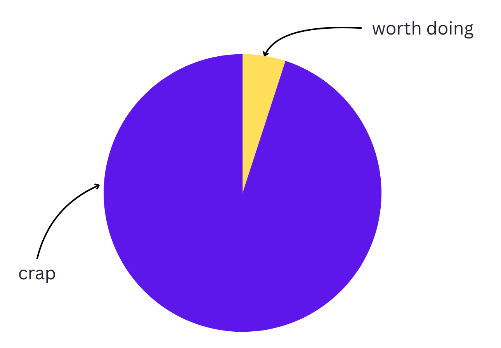

# Sturgeon's Law

**Category**: quality
**Detection**: manual
**Short description**: Ninety percent of everything is crud.

## Overview

In the tech sphere, Sturgeon's Law implies that most code, features, and projects are not essential. Roughly 90% of experiments or features don't pan out, and only 10% drive real value. Not every line of code is gold; not every feature delights users.

It pairs with a reframing of the "10x engineer": not someone who writes ten times more code, but someone who identifies the 10% of work that delivers ten times the value. The risk isn't the lower quality of the 90% itself — it's the pretense that everything matters equally. When a team treats all work as equally valuable, complexity accumulates and delivery slows.

## Takeaways

- It is an extreme form of the Pareto Principle. The bulk of what is put out just isn't good; the good stuff is the exception, not the rule.
- In software, many features and code paths add very little value. The critical challenge is to find and invest in the high-impact 10%.
- Most new concepts, libraries, or technologies fail to deliver. The exceptional ones stand out precisely because the baseline is mediocre.

## Examples

An app with 100 features will typically show, via analytics, that users heavily use about 10 of them and mostly ignore the rest — exactly what Sturgeon's Law predicts. The long tail isn't providing significant value, but it is costing maintenance, UI real estate, and cognitive load.

An organization planning a quarter's roadmap might list dozens of project ideas. Sturgeon's Law suggests most will not amount to much, and a few may be game-changers. The question is whether you can tell which is which in advance — and whether your resourcing reflects that reality.

## Signals
- Not directly detectable; a philosophical stance rather than a code rule.

## Scoring Rubric
- ⚪ **Manual**: reflect on the prompts below.

## Reflection Prompts
- Of the libraries / services / frameworks you depend on, which 10% are genuinely excellent? Which 90% are the default?
- When evaluating new tools, do you assume most are mediocre by default?
- Of your own past code, what fraction would you call "the good 10%"?

## Remediation Hints
- Raise the bar: don't default to "it works, ship it." Compare against the best in class.
- Kill mediocre projects/modules; don't maintain the 90%.
- Invest disproportionately in the 10% that actually matters.

## Origins

Theodore Sturgeon, a science fiction author, coined the phrase in 1957 in response to critics who claimed "90% of science fiction is crap." His response: "90% of everything is crap." It was first published as "Sturgeon's Revelation" in a 1957 issue of *Venture* magazine and has been applied to essentially every creative and technical domain since.

## Further Reading

- [Sturgeon's Law - Wikipedia](https://en.wikipedia.org/wiki/Sturgeon%27s_law)
- [Over 50% of plugins in the WordPress repository haven't been updated in 2+ years](https://www.reddit.com/r/Wordpress/comments/1n0lnas/over_50_of_plugins_in_the_wordpress_repository/)

## Related Laws

- [Goodhart's Law](../planning/goodhart.md)
- [Gall's Law](../architecture/gall.md)
