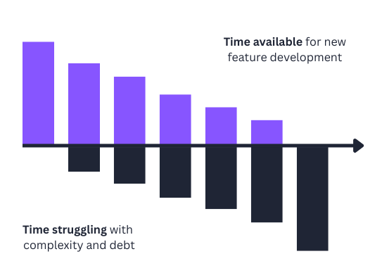

# Technical Debt

**Category**: quality
**Detection**: hybrid
**Short description**: Suboptimal shortcuts accumulate, slowing future work.

## Overview

Technical Debt represents everything that slows us down when developing software. The concept illustrates a fundamental tension between speed and quality. When developers take shortcuts or postpone cleanup work, they essentially take out a loan — gaining short-term feature delivery while accumulating complexity that functions as ongoing interest payments.

Properly managed technical debt can be an effective tool for intentionally trading some messiness to meet deadlines or gather feedback, with a plan to address it later. Unmanaged debt becomes increasingly problematic over time, eventually consuming so much capacity in interest payments that new feature work grinds to a halt.

## Takeaways

- When taking code shortcuts, developers borrow time from the future — gaining immediate benefits but owing principal (the repair work) plus interest.
- Unrepaid technical debt accrues interest; each minute spent fighting dirty code, bugs, and workarounds is interest on the debt.
- Not all technical debt is negative; it's sometimes necessary for market timing or prototyping purposes.
- Technical debt is repaid through refactoring, adding missing tests, and improving design.

## Examples

**Skipped tests**: A team under deadline pressure releases a feature without automated tests. Initial success gives way to risky future changes due to missing coverage, eventually forcing the team to pause feature work and pay down the debt through testing and refactoring.

**Startup shortcuts**: A startup rapidly develops messy code with hardcoded variables and copy-paste duplication to onboard their first customer. It wins the business, but the codebase accumulates bugs and performance issues, and the team schedules a "rehab sprint" to resolve the critical ones.

## Signals
- `todos` age + density (old, unchanged TODOs are interest-bearing debt).
- `hotspots`: files with high churn and high complexity = where debt compounds.
- `complexity.long_function_ratio`: how much of the code is above the clear-thinking threshold.
- `git_evolution.velocity_ratio < 0.5`: decelerating velocity can indicate debt drag.

## Scoring Rubric
- 🟢 **Pass**: explicit tech-debt log, low TODO age, stable velocity.
- 🟡 **Watch**: noticeable TODOs/FIXMEs, some hotspots, velocity holding.
- 🔴 **Concern**: old TODOs accumulated, hotspots grow, velocity declining.
- ⚪ **Manual**: debt is partly about future intent — ask the team.

## Evidence Format
- TODO age stats + top 3 hotspots + velocity ratio.

## Remediation Hints
- Track debt in an issue tracker with interest rate (how much work it blocks).
- Budget 10–20% of each sprint for debt paydown on active hotspots.
- "Move fast" is defensible only if you also "pay fast."

## Origins

Ward Cunningham, co-author of the Agile Manifesto, coined the term "Technical Debt" at the 1992 OOPSLA conference. He developed the financial metaphor while working on a finance application to explain to management why the team needed refactoring time: it can be wise to take shortcuts (borrow) to achieve something sooner, provided you pay back the loan by cleaning up the code later.

## Further Reading

- [Debt Metaphor (Ward Cunningham)](https://www.youtube.com/watch?v=pqeJFYwnkjE)
- [Technical Debt (Martin Fowler)](https://martinfowler.com/bliki/TechnicalDebt.html)
- [Technical Debt (Wikipedia)](https://en.wikipedia.org/wiki/Technical_debt)
- [Accelerate (Forsgren, Humble, Kim)](https://amzn.to/48Xugp3)

## Related Laws

- [Broken Windows Theory](./broken-windows.md)
- [Hofstadter's Law](../planning/hofstadter.md)
- [The Boy Scout Rule](./boy-scout.md)
