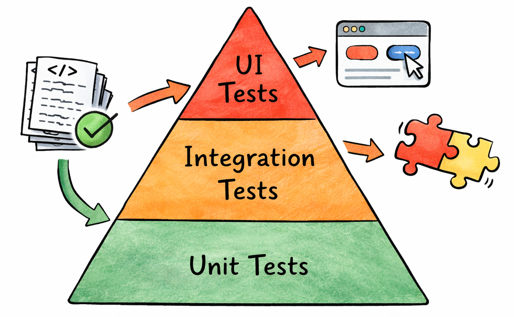

# The Testing Pyramid

**Category**: quality
**Detection**: code
**Short description**: Many unit tests, fewer integration tests, very few end-to-end tests.

## Overview

The Testing Pyramid is a visual metaphor: the largest base layer is unit tests — fast, numerous, and cheap. The middle is integration tests in smaller quantities, and the top is UI / end-to-end tests in minimal numbers. As you move up the pyramid, tests become more expensive in time, effort, and fragility, so you want proportionally fewer of them.

Following this structure means most bugs are caught at the cheapest level, with fast feedback to developers. Inverting the pyramid — prioritizing end-to-end tests over unit tests — produces a test suite that tends to be slow, fragile, and full of false positives that are hard to distinguish from real bugs.

## Takeaways

- Unit tests execute quickly against isolated functions, so you can afford to write a lot of them and run them on every commit.
- Integration tests form the middle layer, verifying that modules cooperate correctly. Fewer are needed than at the unit level.
- End-to-end tests at the top simulate real user flows; they are essential but slow and costly to maintain, so keep their count small.
- A healthy pyramid enables quick feedback because most tests are fast unit tests, reducing the noise of flaky UI test failures.

## Examples

An e-commerce app following the pyramid might implement hundreds of unit tests for price calculation and validation logic, dozens of API integration tests for order processing, and a handful of end-to-end tests for core user journeys. Business logic bugs get caught cheaply, and CI stays fast.

By contrast, a team with minimal unit tests that relies on 50 nightly GUI tests experiences hours-long test runs, constant trouble distinguishing real bugs from flakiness, and slow feedback to developers. This is the anti-pattern — the "ice cream cone" — the pyramid warns against.

## Signals
- `test_ratio.unit` / `integration` / `e2e` counts.
- `test_ratio.test_to_source_ratio`: total test coverage breadth.
- `test_ratio.unit_pct < 50` → inverted pyramid.
- `test_ratio.e2e_pct > 30` → top-heavy.

## Scoring Rubric
- 🟢 **Pass**: unit ≥70% of tests, integration ~20%, e2e ≤10%. Test-to-source ratio ≥0.3.
- 🟡 **Watch**: unit 50-70%, or low total test volume.
- 🔴 **Concern**: unit <50% (inverted), or no tests at all.
- ⚪ **Manual**: hard to classify — tests live outside repo, or category hints are ambiguous.

## Evidence Format
- `test_ratio` counts + percentages.

## Remediation Hints
- Aim for unit > integration > e2e by at least 3:1 ratios.
- When a bug slips through unit tests, write a unit test — don't just add an e2e.
- E2E tests are for user journeys, not for every branch.

## Origins

Mike Cohn popularized the Testing Pyramid around 2009 through his book *Succeeding with Agile* and related blog posts. The concept builds on earlier testing theory, including ISTQB foundations and Test-Driven Development practices. Modern refinements (honeycombs, trophies, diamonds) tweak the shape, but the core principle holds: test more at the unit level than at the UI level.

## Further Reading

- [The Practical Test Pyramid (Martin Fowler)](https://martinfowler.com/articles/practical-test-pyramid.html)
- [Succeeding with Agile](https://amzn.to/4pb7Q8v)
- [Test Automation at Different Levels - Wikipedia](https://en.wikipedia.org/wiki/Test_automation#Testing_at_different_levels)
- [Software Engineering at Google, Chapter 11: Testing Overview](https://abseil.io/resources/swe-book/html/ch11.html)

## Related Laws

- [Lehman's Laws of Software Evolution](../addenda/lehman.md)
- [Pesticide Paradox](./pesticide-paradox.md)
