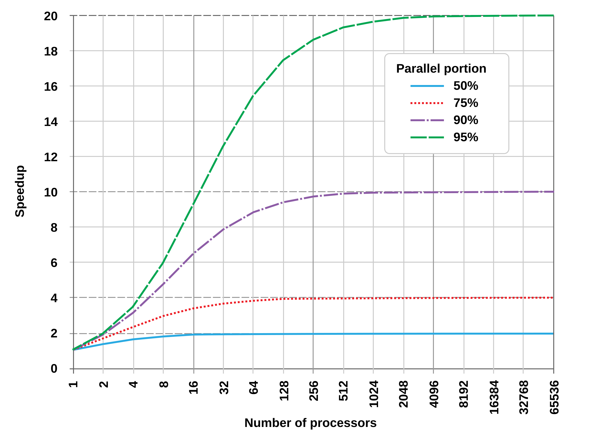

# Amdahl's Law

**Category**: scale
**Detection**: manual
**Short description**: The speedup from parallelization is capped by the serial fraction of the work.

## Overview

As CPU cores increase, only the parallelizable fraction of code speeds up. The sequential portion stays constant and eventually becomes the dominant factor in total execution time. With "s" representing the sequential fraction, maximum speedup with unlimited parallel resources equals 1/s. For example, 10% sequential code yields at most a 10x speedup; 50% sequential code yields at most a 2x speedup.

The principle extends far beyond CPUs. When a database cannot be parallelized, adding application servers hits diminishing returns. Organizations face the same constraint: if one person or committee controls architectural decisions, hiring more engineers just increases coordination overhead without improving decision throughput.

## Takeaways

- Sequential work sets the ceiling, and no amount of parallelism can overcome it.
- Scaling exposes bottlenecks. More resources make limits visible, not vanish.
- Fix before you scale: reduce sequential paths first. Parallelism comes second.
- It applies to people, too. Decision bottlenecks dominate at team scale.

## Examples

Adding application servers provides no benefit when every request converges on a single database instance. One database becomes the hard constraint — the serial fraction you can't escape by buying more app servers.

Breaking a monolith into microservices fails to enhance performance when requests serialize through shared dependencies like authentication or billing. You moved the bottleneck; you didn't remove it.

## Signals
- Presence of parallelism primitives (threads, async, workers, map-reduce, goroutines).
- Code with a clear serial bottleneck (single-threaded lock, queue, or coordinator) wrapping parallel work.

## Scoring Rubric
- ⚪ **Manual**: applicability depends on whether parallel performance matters.
- ➖ **N/A**: non-parallel workload.

## Reflection Prompts
- What's the serial fraction of your hot path? Have you measured it?
- Can the serial bottleneck be eliminated or merely moved?
- If you doubled the worker count, do you expect near-2x or <1.2x speedup?

## Remediation Hints
- Measure before parallelizing — Amdahl caps the win.
- Attack the serial bottleneck first; then parallelize what remains.
- Consider whether the problem could be restructured to be embarrassingly parallel.

## Origins

Gene Amdahl introduced the principle in 1967 at the AFIPS Spring Joint Computer Conference. Originally focused on processor performance, the law has proven remarkably general — applicable to distributed systems, pipelines, and organizational design.

## Further Reading

- [Validity of the Single Processor Approach to Achieving Large Scale Computing Capabilities (Amdahl, 1967)](https://dl.acm.org/doi/10.1145/1465482.1465560)
- [Amdahl's Law - Wikipedia](https://en.wikipedia.org/wiki/Amdahl%27s_law)
- [The Mythical Man-Month](https://amzn.to/3MUjDL7)

## Related Laws

- [Gustafson's Law](./gustafson.md)
- [Metcalfe's Law](./metcalfe.md)
