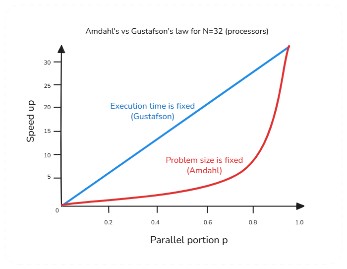

# Gustafson's Law

**Category**: scale
**Detection**: manual
**Short description**: Speedup from parallelism grows with problem size — bigger problems benefit more from more cores.

## Overview

Gustafson's Law offers an optimistic counterpoint to Amdahl's Law. While Amdahl assumes a fixed problem size with a hard cap on speedup, Gustafson reframes the question: when more processors are available, developers tend to grow the problem size to use the extra power. A cluster with twice the capacity can process twice the data in the same time window.

The parallel portion of work grows with N processors while the serial portion stays about the same, producing "scaled speedup" that can be nearly linear. The law is an argument for designing systems to scale out, so that adding cores or machines means tackling bigger problems rather than solving a fixed problem fractionally faster.

## Takeaways

- As computing resources expand, you tackle more problem in a given time rather than solving the same problem faster.
- It rejects the pessimism of Amdahl's Law by assuming problem size grows proportionally with available compute.
- Gustafson argues for using extra resources to expand task scope rather than accepting diminishing returns on a fixed workload.
- Software and algorithms should be designed to scale out so that more processors or machines translate directly into more throughput.

## Examples

In high-performance computing, climate models and molecular simulations increase their resolution when more processors are available. A weather simulation on 1000 CPUs doesn't finish 1000x faster; instead, it runs a much more detailed global model in the same wall-clock time, improving forecast quality.

In big data, analyzing one million records per hour on a single machine extrapolates to analyzing ten million records per hour on a ten-node cluster. Distributed frameworks like MapReduce and Spark partition datasets across more nodes as infrastructure grows, keeping processor utilization high as work expands.

## Signals
- Fixed-size batch processors vs. workloads that scale with input size.
- Architecture assumes a constant "dataset" size rather than scaling work with cores.

## Scoring Rubric
- ⚪ **Manual**: requires knowing workload shape.
- ➖ **N/A**: small, fixed workloads.

## Reflection Prompts
- Does your workload grow over time (more users, more data)? Do your parallel units scale with it?
- When adding capacity, do you scale up (bigger problem per core) or scale out (more cores, same problem)?

## Remediation Hints
- Design for scale-out from the start if inputs will grow.
- Favor sharding / partitioning over tuning a fixed-size job.
- Re-evaluate Amdahl's pessimism when problem size grows — Gustafson says the serial share often shrinks in relative terms.

## Origins

Computer scientist John L. Gustafson, working at Sandia National Laboratories, formulated the law with Edwin Barsis in 1988 through the paper "Reevaluating Amdahl's Law." Gustafson's research countered Amdahl's 1967 pessimistic conclusions about massively parallel systems by demonstrating that a 1024-processor system could achieve near-linear speedup when problem size scaled appropriately.

## Further Reading

- [Reevaluating Amdahl's Law (Gustafson, 1988)](https://dl.acm.org/doi/10.1145/42411.42415)
- [Gustafson's Law - Wikipedia](https://en.wikipedia.org/wiki/Gustafson%27s_law)

## Related Laws

- [Amdahl's Law](./amdahl.md)
- [Metcalfe's Law](./metcalfe.md)
