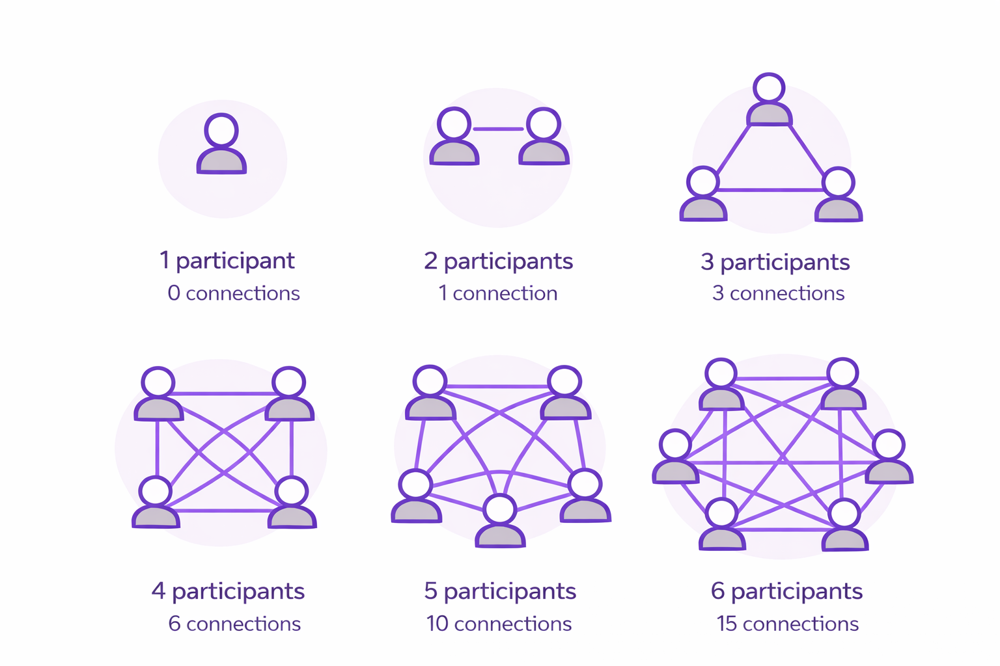

# Metcalfe's Law

**Category**: scale
**Detection**: manual
**Short description**: The value of a network is proportional to the square of the number of users.

## Overview

Metcalfe's Law states that the value of a network is proportional to the square of the number of connected users. With 5 nodes, there are up to 10 pairwise connections; with 12 nodes, 66. Network effects create self-reinforcing dynamics: early adopters see minimal value, but once critical mass is achieved, each additional user generates exponentially more interactions. This explains the rapid growth curves of social platforms.

The law is a simplified model with limitations. Not every participant actually connects with every other, and marginal value eventually plateaus. Still, it effectively illustrates the winner-takes-all dynamics common in tech markets, including the reverse case: as users leave, declining value accelerates further departures in a death spiral.

## Takeaways

- Doubling users roughly quadruples potential connections, not just doubles value.
- Each new user creates value for existing users through fresh interaction opportunities, making platforms exponentially more useful as adoption grows.
- The law explains explosive growth in social media and messaging platforms once critical adoption is reached — and explains equally sharp collapses when the network shrinks.

## Examples

Facebook offered low utility when only a handful of friends were members, but became indispensable once social circles fully adopted it. WhatsApp and WeChat show the same pattern: each new user unlocks conversations with many others, compounding the platform's reach. When users begin leaving, the value drops faster than linearly, triggering potential death spirals (see: former social networks that shall remain nameless).

## Signals
- Whether the product/library has network effects (chat, marketplaces, social, shared-doc tools).

## Scoring Rubric
- ⚪ **Manual**: product-level property.
- ➖ **N/A**: single-user tools, internal libraries.

## Reflection Prompts
- Does your product's value increase when more people use it? How do you measure that?
- Have you built features that reward existing users when new users join?
- What's your biggest bottleneck to adding the "next N" users — technical or social?

## Remediation Hints
- Optimize onboarding + sharing; compounding user count is leverage.
- Watch out for the dual: negative network effects (spam, moderation overhead) also scale super-linearly.

## Origins

Robert Metcalfe proposed the concept around 1980 while discussing Ethernet adoption, presenting the idea to 3Com in 1983. He argued that network value grows quadratically as compatible devices increase. George Gilder popularized the term in a 1993 *Forbes* article, using Metcalfe's diagram to explain internet growth.

## Further Reading

- [Metcalfe's Law: more misunderstood than wrong?](https://blog.simeonov.com/2006/07/26/metcalfes-law-more-misunderstood-than-wrong/)
- [Metcalfe's Law - Wikipedia](https://en.wikipedia.org/wiki/Metcalfe%27s_law)
- [Metcalfe's Law and Legacy](https://www.discovery.org/a/41/)
- [Tencent and Facebook Data Validate Metcalfe's Law](https://doi.org/10.1007/s11390-015-1518-1)

## Related Laws

- [Amdahl's Law](./amdahl.md)
- [Gustafson's Law](./gustafson.md)
