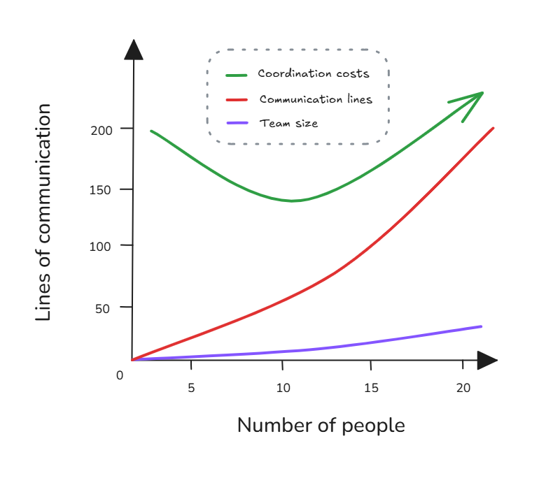

# Brooks's Law

**Category**: teams
**Detection**: manual
**Short description**: Adding people to a late software project makes it later.

## Overview

Brooks's Law challenges the belief that a software development effort is perfectly divisible among people. In reality, adding a person to a project incurs training costs and increases the number of communication paths.

New team members require onboarding time, consuming existing developers' bandwidth for instruction and coordination, thereby diminishing collective output. The law employs a memorable comparison: "You cannot get a baby in one month by impregnating nine women." While the principle doesn't claim adding staff never proves beneficial, deploying additional developers as a remedy for project delays typically produces counterproductive results and potential system degradation.

## Takeaways

- Simply throwing more developers at a project that's running behind schedule usually slows it down further initially.
- New people take time to get up to speed, consuming existing team members' time for training and coordination, which reduces overall productivity.
- Instead of hoping manpower will solve slippage, adjust the scope or timeline. Be wary of "just hire more coders" as a solution to lateness.

## Examples

A project is one month behind schedule, so management adds 3 new developers to a 5-person team. Over the next few weeks, progress slows. The original developers spend much of their time explaining the design and code to newcomers, and merging their work causes integration headaches. The project slips further, now two months late.

A complex bug required deep knowledge of the system. Adding more people didn't help because only the original dev understood it, and more debuggers only made things worse. Scaling a software team isn't linear. After a point, more members yield less and less output per person.

## Signals
- Not detectable from code alone. Loosely proxied by sudden spikes in new committers on a late-stage feature branch.

## Scoring Rubric
- ⚪ **Manual**: reflect on the prompts below.

## Reflection Prompts
- Have you added people to a slipping project in the last year? What happened to delivery?
- When onboarding a new contributor, how long before they ship production code unsupervised?
- What's your ratio of coordination time to individual contribution time on large features?

## Remediation Hints
- Prefer slipping scope or dates over adding headcount late.
- Pair new joiners with a mentor who is NOT on the critical path.
- Split monolithic work into streams that can absorb help at the seams.

## Origins

Frederick P. Brooks Jr., who managed the IBM OS/360 project, formulated this law based on painful experience. His 1975 publication *The Mythical Man-Month* examines software project failures and management misconceptions. Brooks challenged the widespread assumption that programmer-months represent interchangeable units, demonstrating through practical cases why assigning 12 programmers a one-month task cannot duplicate one programmer's twelve-month effort.

## Further Reading

- [The Mythical Man-Month](https://amzn.to/4peJbjC)
- [Brooks's Law - Wikipedia](https://en.wikipedia.org/wiki/Brooks%27s_law)
- [No Silver Bullet](https://en.wikipedia.org/wiki/No_Silver_Bullet)

## Related Laws

- [Conway's Law](../teams/conway.md)
- [Second-System Effect](../architecture/second-system.md)
- [Law of Unintended Consequences](../addenda/unintended-consequences.md)
