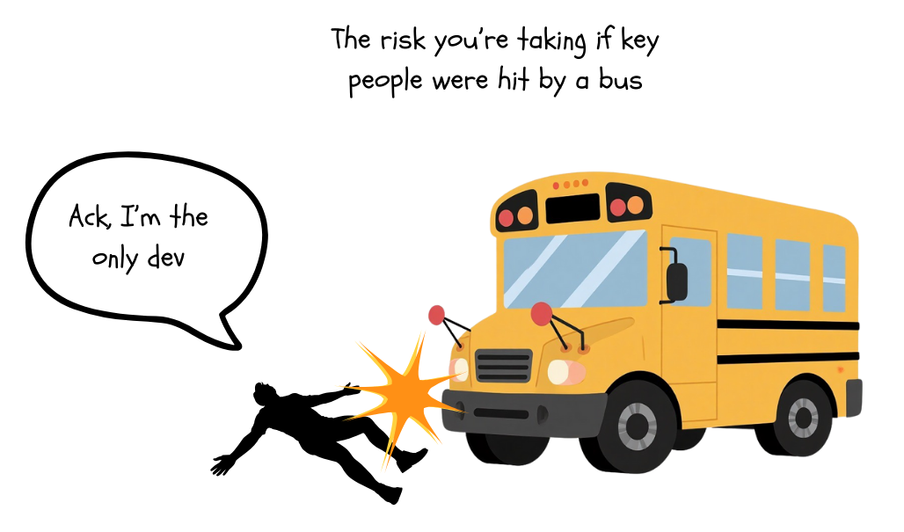

# Bus Factor

**Category**: teams
**Detection**: git-history
**Short description**: Minimum number of team members whose disappearance would jeopardize the project.

## Overview

The Bus Factor highlights the human single point of failure in projects. In many software teams, one or two people might understand the legacy system, a crucial algorithm, or have all the deployment knowledge. If those people leave, others cannot easily pick up the work.

The concept encourages actively avoiding such dependency. Improving bus factor overlaps with knowledge management practices: pair programming, code reviews, documentation, mentorship, and rotating responsibilities.

## Takeaways

- A bus factor of 1 means one person holds critical knowledge; if they disappear, the project is essentially "doomed" or stalled. A higher bus factor (e.g., 5) means the project could lose any one of five specific people before stopping work.
- It's basically a measure of knowledge distribution and risk. A high bus factor is good (knowledge is shared among many), while a low is bad (single points of failure in expertise).
- Teams should work to increase their bus factor by sharing knowledge, documenting critical systems, having code reviews, and rotating responsibilities.

## Examples

If a startup's only database expert is Alice, the bus factor for database knowledge is 1. If Alice quits, nobody else knows the backups, schema intricacies, or tuning.

The **Left-pad incident** reflects a bus factor of 1 for the broader ecosystem: a single maintainer pulled a tiny NPM package, and thousands of builds broke.

## Signals
- `bus_factor.bus_factor` (repo-wide): authors needed to cover 50% of lines.
- `bus_factor.dominated_files`: files where one author owns ≥80% of lines.
- `bus_factor.single_owner_dirs`: whole directories owned by one person.

## Scoring Rubric
- 🟢 **Pass**: bus_factor ≥ 3 AND fewer than 10% of files dominated.
- 🟡 **Watch**: bus_factor == 2, or 10–30% of files dominated.
- 🔴 **Concern**: bus_factor ≤ 1, or >30% of files dominated, or ≥3 directories >90% single-owner.
- ⚪ **Manual**: not a git repo / insufficient history.

## Evidence Format
- Cite `bus_factor.bus_factor`, list top-3 dominated files by share with file paths.

## Remediation Hints
- Pair program on single-owner modules; have the owner onboard a backup.
- Rotate feature ownership across release cycles.
- Write "why" docs for the dominated areas; code alone doesn't preserve intent.

## Origins

The concept was popularized in the 1990s in discussions of project risk. The term is somewhat morbid, so some call it "lottery factor" (flipping the scenario to a positive reason someone leaves). It's not attributed to a single person but emerged as slang in software teams. An early reference appears in patterns literature (1994 PLoP conference), discussing "truck number" in organizational patterns.

## Further Reading

- [Bus Factor - Wikipedia](https://en.wikipedia.org/wiki/Bus_factor)
- [Left-pad incident - Wikipedia](https://en.wikipedia.org/wiki/Npm_left-pad_incident)
- [The Dead Sea Effect - Bruce F. Webster](https://brucefwebster.com/2008/04/11/the-wetware-crisis-the-dead-sea-effect/)
- [If Guido was hit by a bus?](https://legacy.python.org/search/hypermail/python-1994q2/1040.html)
- [Organizational Patterns of Agile Software Development](https://www.wiley.com/en-us/Organizational+Patterns+of+Agile+Software+Development-p-9780131467408)

## Related Laws

- [Conway's Law](../teams/conway.md)
- [Brooks's Law](../teams/brooks.md)
- [Dunbar's Number](../teams/dunbar.md)
