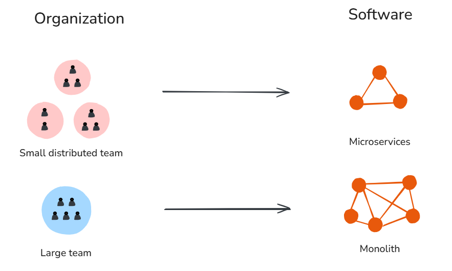

# Conway's Law

**Category**: teams
**Detection**: hybrid
**Short description**: Organizations design systems that mirror their communication structure.

## Overview

Conway's Law states that software systems reflect the communication structure of the organization that builds them. A company with separate frontend, backend, and database departments will likely produce a three-tier architecture. Small, distributed teams tend to produce modular service architectures, while large, collocated teams tend to build monoliths.

To mitigate this, teams can use the "Inverse Conway Maneuver": intentionally structuring the organization to match the desired software architecture.

## Takeaways

- The architecture of software systems often mirrors the organization's org chart or team structure.
- If your company is organized in silos, you might end up with siloed software modules that don't communicate well.
- To achieve a desired software architecture (e.g., microservices), you might need to restructure teams accordingly.
- When starting a project, realize that how you split teams or departments will likely lead to software boundaries at the same places.

## Examples

A company had separate departments for frontend, backend, and database. The software they built had a three-tier architecture, with each tier independently designed by its respective department. Integration between tiers was painful because the teams had misaligned goals.

Amazon famously organized "two-pizza teams", each owning a specific service. Conway's Law suggests that's why Amazon's architecture is service-oriented, with clear API contracts between services.

## Signals
- `bus_factor.single_owner_dirs`: top-level directories dominated by a single author (module-to-person mapping).
- Divergent coding styles, frameworks, or languages across top-level modules (hints at separate teams).
- Inconsistent API conventions between modules (REST here, GraphQL there, RPC in a third).
- Cross-module imports forming a cycle or creating a star topology that doesn't match the org chart.

## Scoring Rubric
- 🟢 **Pass**: 2+ authors per major module; module boundaries match deliberate service/team boundaries; uniform conventions.
- 🟡 **Watch**: some module-author alignment is visible but not extreme; uneven conventions.
- 🔴 **Concern**: ≥3 top-level modules each dominated (>90%) by a single distinct author and with divergent styles.
- ⚪ **Manual**: ask the user about team structure; we can't infer intent from code alone.

## Evidence Format
- Cite `single_owner_dirs` count and name the directories with file:line of a sample file in each.

## Remediation Hints
- Rotate code ownership through pairing or rotations.
- Explicitly design module boundaries from product intent, not accidental team scope.
- Add CODEOWNERS + PR review rules that spread context.

## Origins

Melvin Conway introduced the idea in his 1967 paper "How Do Committees Invent?" After Harvard Business Review rejected it for lacking formal proof, Datamation published it in 1968. Fred Brooks later named it "Conway's Law" in *The Mythical Man-Month*, which established the concept as foundational in software engineering.

## Further Reading

- [How Do Committees Invent?](https://www.melconway.com/Home/Committees_Paper.html)
- [Conway's Law (Martin Fowler)](https://martinfowler.com/bliki/ConwaysLaw.html)
- [Spotify Engineering Culture](https://engineering.atspotify.com/2014/3/spotify-engineering-culture-part-1)
- [Team Topologies](https://amzn.to/4jgRZ6V)

## Related Laws

- [Brooks's Law](../teams/brooks.md)
- [Gall's Law](../architecture/gall.md)
- [The Law of Leaky Abstractions](../architecture/leaky-abstractions.md)
- [Hyrum's Law](../architecture/hyrum.md)
