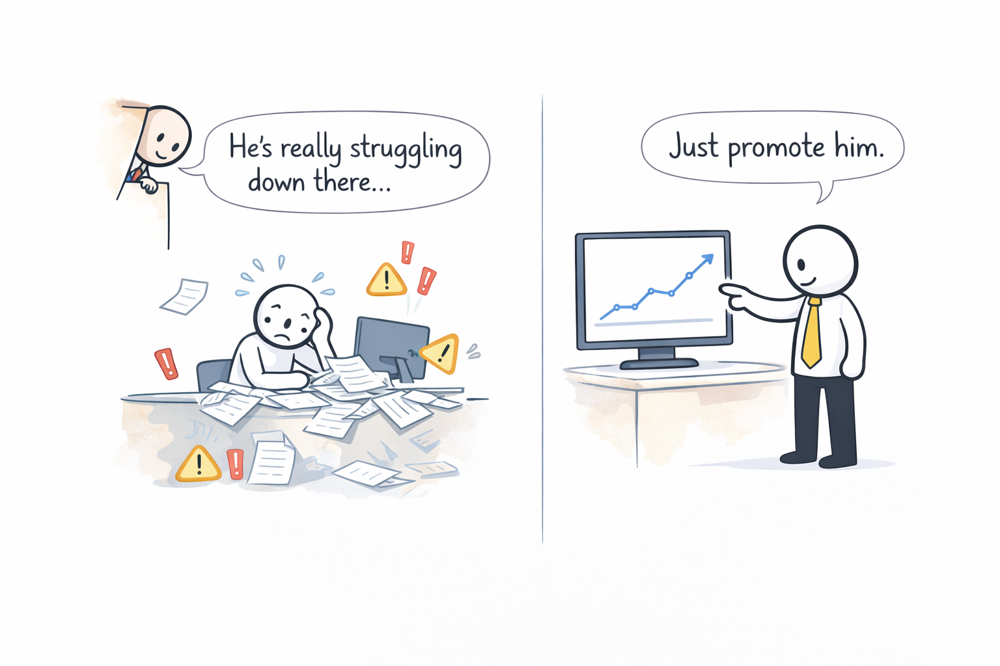

# The Dilbert Principle

**Category**: teams
**Detection**: manual
**Short description**: Companies systematically promote their least-competent employees into management to limit the damage.

## Overview

The Dilbert Principle suggests that instead of addressing poor performance directly, companies often promote struggling employees into management roles where their impact is perceived as less immediately harmful. The approach treats management as a default career progression without considering employee aptitude or preferences. This practice fills management layers with people lacking technical credibility or leadership ability, ultimately resulting in poor decision-making and eroded organizational trust.

## Takeaways

- Organizations sometimes deal with underperformers by promoting them into management, removing them from hands-on work.
- It reflects a cynical view that lower-level employees do real work while some managers add little value.
- Technical excellence and people leadership require different skills. Failing at one does not qualify someone for the other.

## Examples

Many engineers report experiences resembling Dilbert scenarios where underperforming programmers or struggling project leads receive "promotions" to management or architect positions. Sometimes these moves are less about recognizing leadership talent and more about getting a problematic person away from critical work. However, awareness has prompted positive changes; modern tech companies increasingly offer dual career tracks to avoid forcing talented engineers into management roles against their strengths.

## Signals
- Not detectable from code.

## Scoring Rubric
- ⚪ **Manual**: reflect on the prompts below.

## Reflection Prompts
- Are the managers here chosen for leadership skill, or moved there because they weren't shipping as ICs?
- Do promotions into management correlate with IC performance or IC struggle?
- Does your ladder reward and retain senior ICs, or funnel everyone toward management?

## Remediation Hints
- Explicit leadership criteria separate from IC performance.
- Management is a skill — hire/promote deliberately, train, and evaluate.
- Offer a lateral IC track (staff/principal) that is equally prestigious.

## Origins

Scott Adams introduced the Dilbert Principle in his 1996 book *The Dilbert Principle*. While the framing is exaggerated, the underlying organizational critique resonated strongly with engineers across industries.

## Further Reading

- [The Dilbert Principle - Wikipedia](https://en.wikipedia.org/wiki/Dilbert_principle)
- [The Dilbert Principle - Amazon](https://amzn.to/4jgz6kJ)
- [A Cubicle's-Eye View of Bosses, Meetings, Management Fads and Other Workplace Afflictions](https://www.amazon.com/Dilbert-Principle-Cubicles-Eye-Meetings-Management/dp/0887308589)

## Related Laws

- [Peter Principle](../teams/peter.md)
- [Putt's Law](../teams/putt.md)
- [Brooks's Law](../teams/brooks.md)
