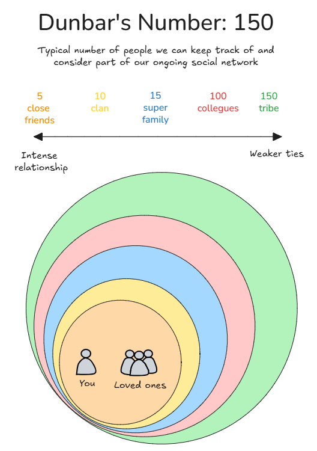

# Dunbar's Number

**Category**: teams
**Detection**: manual
**Short description**: Humans can maintain roughly 150 stable relationships.

## Overview

Dunbar's Number means that an engineering department of 150 might function informally, but as it grows past that, you start needing more formal rules, communication channels, and management layers. Informal knowledge ("I know who to talk to about X") begins to fail, and teams feel impersonal.

The rule encourages designing sub-teams or "teams of teams" that are small enough to work together effectively. Dunbar also proposed smaller social layers: ~5 intimate relationships, ~15 trusted collaborators, ~50 close working relationships, and ~150 stable social connections.

For software teams, high-trust work happens in tiny groups, teams larger than ~10-15 lose cohesion, and the 150 limit applies to departments or communities, not day-to-day collaboration.

## Takeaways

- Dunbar's number (~150) is the size of a community in which everyone knows each other's identities and roles.
- In software organizations, teams larger than ~100-150 will require more hierarchy or splitting into subgroups.
- Smaller limits exist for closer relationships. Effective working groups might be much smaller than 150.
- Strong collaboration happens in groups far below the 150 threshold. Small teams win.

## Examples

Many startups report that around the 150-employee mark, the culture shifts. You no longer know everyone's name, informal communication falters, and you start needing all-hands meetings and internal newsletters.

The Linux kernel community demonstrates structured communication through mailing lists by subsystem, limiting direct peer interaction. Amazon's "two-pizza teams" (5-10 people) exemplify effective working units within the broader 150-person framework.

## Signals
- Not detectable from code. Organizational scale affects knowledge-sharing and team cohesion, not the repo.

## Scoring Rubric
- ⚪ **Manual**: reflect on the prompts below.

## Reflection Prompts
- How many people work on this codebase? (1-10 / 10-50 / 50-150 / 150+)
- Do you know every contributor by name and what they focus on?
- When a team grows past ~30, how do you preserve context-sharing?

## Remediation Hints
- Split teams into units of ≤10 with clear inter-team interfaces.
- Document "team APIs" (what each team owns, who to ping) as code grows.

## Origins

Robin Dunbar introduced this concept in a 1992 paper and popularized it through his book *Grooming, Gossip, and the Evolution of Language*. He identified a correlation between primate neocortex size and social group size, predicting human capacity at approximately 150. Historical examples including village sizes, military company units, and communal groups typically range between 100-200, supporting this figure.

## Further Reading

- [Dunbar's Number - Wikipedia](https://en.wikipedia.org/wiki/Dunbar%27s_number)
- [Grooming, Gossip, and the Evolution of Language](https://www.amazon.com/Grooming-Gossip-Evolution-Language-Dunbar/dp/0674363361)

## Related Laws

- [Conway's Law](../teams/conway.md)
- [Brooks's Law](../teams/brooks.md)
