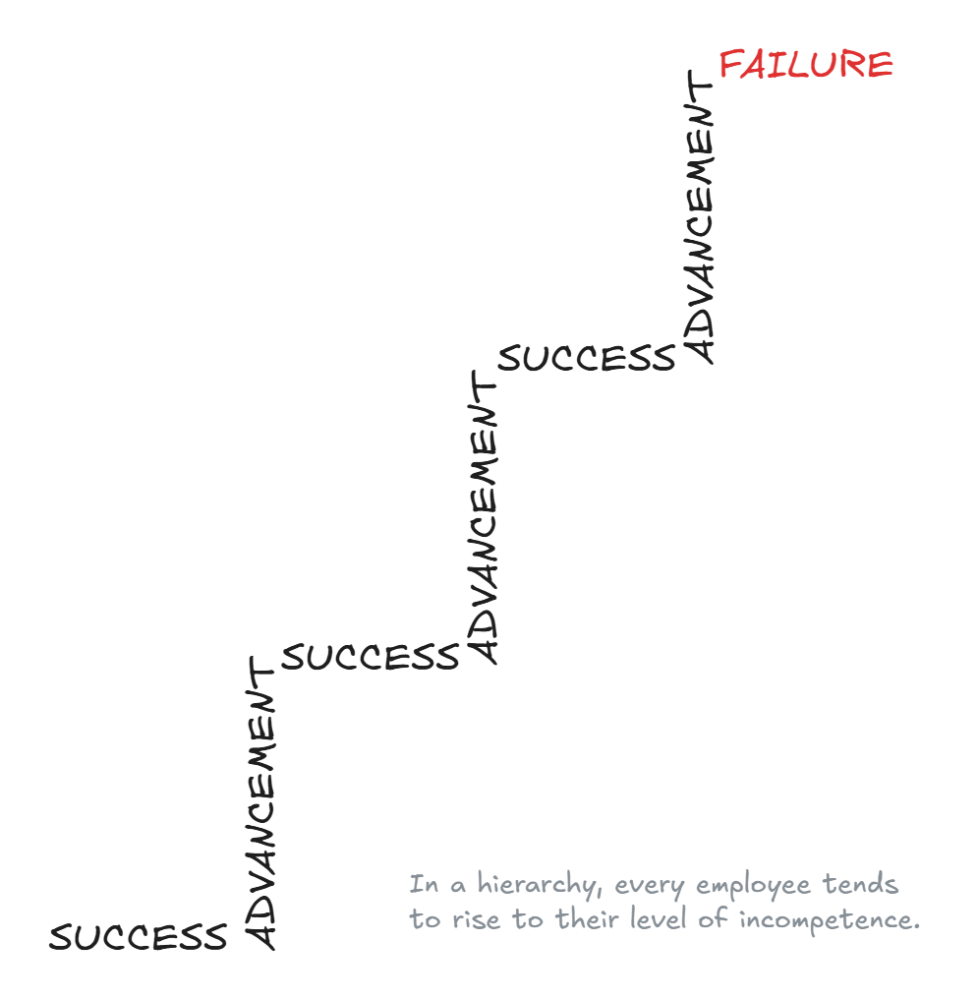

# The Peter Principle

**Category**: teams
**Detection**: manual
**Short description**: People in a hierarchy rise to their level of incompetence.

## Overview

The Peter Principle explains why organizations often end up with mediocre managers. A great engineer gets promoted to tech lead but struggles in the role, and now the company has lost a great engineer. For organizational health, it's vital to address this issue. Not all senior engineers should become managers; some might progress as staff or principal engineers instead. New managers need training to ensure competence in their new role. The Peter Principle warns that promotion systems can create mediocrity at higher levels if not designed carefully.

## Takeaways

- People get promoted based on success in their current role until they reach a position where they are no longer competent.
- A great developer promoted to manager might perform poorly, losing a good developer and gaining a bad manager.
- Organizations should offer dual career paths (technical vs. managerial) to prevent this stagnation.

## Examples

In a development team, Alice is the best programmer. Management appoints her team manager since she's the most experienced. But she has no experience or desire for people management. She either micromanages or neglects essential tasks while coding less. Consider a QA engineer fantastic at finding bugs who gets promoted to QA Lead, a role involving paperwork and strategy. Many tech organizations now use individual contributor tracks to prevent forcing talented engineers into management roles.

## Signals
- Not detectable from code.

## Scoring Rubric
- ⚪ **Manual**: reflect on the prompts below.

## Reflection Prompts
- Are promotions primarily rewards for past work, or evaluations of readiness for the new scope?
- Do you have a path for demotion/role-change without stigma if someone is in over their head?
- How often are managers here former ICs who were promoted before they actually wanted to manage?

## Remediation Hints
- Separate "rewarding performance" (bonus, title) from "changing role" (new responsibilities).
- Run trial periods for new managers before making promotions final.

## Origins

The Peter Principle was described in the book *The Peter Principle* by Laurence J. Peter in 1969. It was meant as a humorous piece of sociology and business insight. Scott Adams' Dilbert Principle later offered a cynical inversion, suggesting companies promote incompetent employees to remove them from workflow. Both concepts highlight absurdities in corporate culture.

## Further Reading

- [The Peter Principle - Wikipedia](https://en.wikipedia.org/wiki/Peter_principle)
- [The Peter Principle: Why Things Always Go Wrong](https://amzn.to/48XHHW7)

## Related Laws

- [Dilbert Principle](../teams/dilbert.md)
- [Putt's Law](../teams/putt.md)
