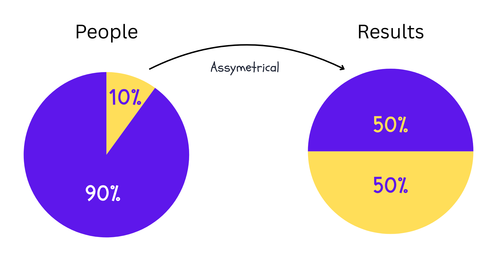

# Price's Law

**Category**: teams
**Detection**: git-history
**Short description**: √N participants produce 50% of total output.

## Overview

You probably noticed that most of the major work depends on just a few people in your organization, and that is not false. In software teams, a small group of engineers delivers disproportionately large value. This pattern is similar to the Pareto principle but even more pronounced in larger groups.

Price's Law suggests that simply hiring more developers won't necessarily scale output as expected. The law emphasizes hiring quality over quantity, as one excellent engineer can outperform several average ones. However, leaders must avoid making other team members feel undervalued, as they often perform essential tasks. A critical risk exists: if those top √N contributors leave, you lose a large chunk of productivity.

## Takeaways

- A small fraction of people often contribute a significant fraction of results.
- As teams grow, productive output doesn't scale linearly.
- Understanding this helps in team planning and recognizing why losing specific individuals significantly impacts productivity.
- It's wise to identify and retain the small group essential to the company's output.

## Examples

Take an open-source project on GitHub with 30 contributors. Often, you'll see that maybe 5 contributors (roughly √30 ≈ 5) are responsible for about half the code commits or major features.

The Twitter case study demonstrates this principle. Before Musk's takeover, with 7,500 employees, Price's Law suggested roughly 87 people drove core operations. When staff was cut by 50%, the platform continued operating because key personnel remained, though Twitter's request for some laid-off workers to return indicated critical skill gaps.

## Signals
- `bus_factor.bus_factor` metric: if √(unique_authors) is roughly the number of authors needed to cover 50% of lines, Price's Law is observed.
- From `git_evolution.unique_authors` + `bus_factor.bus_factor`: compare `bus_factor` to `sqrt(unique_authors)`.

## Scoring Rubric
- 🟢 **Pass**: bus_factor ≈ √authors within ±1 (expected distribution; not inherently bad).
- 🟡 **Watch**: bus_factor < √authors / 2 — output concentrated far below expectation.
- 🔴 **Concern**: bus_factor ≤ 1 with >10 authors — one person carrying the repo.
- ⚪ **Manual**: too few authors/commits to calculate.

## Evidence Format
- State `bus_factor.bus_factor` and `git_evolution.unique_authors`, show the comparison.

## Remediation Hints
- This law is descriptive, not prescriptive. Don't punish uneven distribution — protect the top contributors from burnout and de-risk their bus factor.
- Promote knowledge-sharing (pairing, docs, recorded design reviews).

## Origins

Derek de Solla Price, a British physicist and information scientist, discovered this pattern studying academic peers and noticed a handful dominated publications within each subject. He introduced this concept in his 1963 book *Little Science, Big Science* as part of his broader research on scientific productivity and information dynamics.

## Further Reading

- [Price's Law - Wikipedia](https://en.wikipedia.org/wiki/Price%27s_law)
- [Derek J. de Solla Price - Wikipedia](https://en.wikipedia.org/wiki/Derek_J._de_Solla_Price)

## Related Laws

- [The Ringelmann Effect](../teams/ringelmann.md)
- [Brooks's Law](../teams/brooks.md)
- [Dunbar's Number](../teams/dunbar.md)
