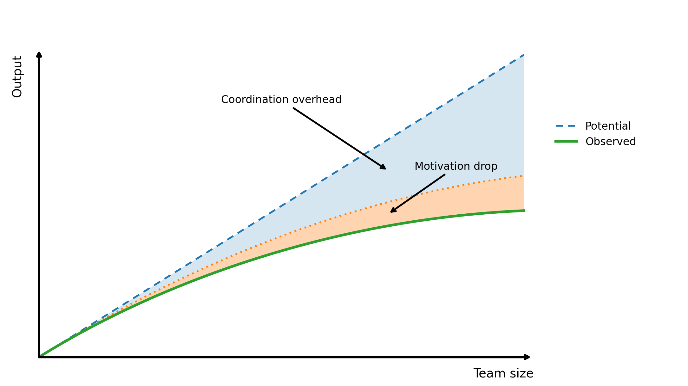

# The Ringelmann Effect

**Category**: teams
**Detection**: manual
**Short description**: Individual productivity declines as group size increases.

## Overview

The Ringelmann Effect states that as more people work together, individual effort decreases. In software contexts, productivity per person often declines in larger groups due to coordination overhead and reduced individual contributions within crowds.

The effect demonstrates that adding team members can make each existing member less efficient. Together with Brooks's Law, it illustrates that teamwork lacks linear scalability. Effective teams require clear role definition and smaller, focused structures to counteract this dynamic.

## Takeaways

- In large teams, some people put in less effort because they assume others will pick up the slack or because their contributions are less visible.
- More people mean more communication, meetings, and alignment needed. Time spent coordinating increases, leaving less time for actual work.
- There is a point at which adding people yields diminishing returns, or even negative returns per person. Small, focused teams often outperform poorly coordinated larger teams.
- Smaller teams or individuals feel greater ownership and responsibility.

## Examples

In a brainstorming session with 3 people, each might contribute many ideas. In a session with 15 people, many participants will say nothing, assuming others will speak.

If 10 developers work on one module, merging code, resolving conflicts, and communicating design decisions can consume significant time. This effect motivates Amazon's "Two Pizza Rule" (a team feedable by two pizzas, roughly 5-8 people).

## Signals
- Not detectable from code directly. Weak proxy: disproportionate drop in commits-per-author as team size grows.

## Scoring Rubric
- ⚪ **Manual**: reflect on the prompts below.

## Reflection Prompts
- Has average output per engineer gone down since the team grew?
- Are meeting hours creeping up relative to focus time?
- Do small subgroups ship proportionally faster than the whole team?

## Remediation Hints
- Give clear, individually attributable ownership.
- Keep standing meetings small; invite-only for larger ones.
- Measure throughput per team (small units), not per engineer.

## Origins

Named after Max Ringelmann, a French agricultural engineer who observed it in physical tasks around 1913. He discovered that individuals exerted less force pulling rope together versus alone. Psychology later termed this "social loafing," subsequently documented across cognitive tasks and workplace productivity scenarios.

## Further Reading

- [Ringelmann Effect - Wikipedia](https://en.wikipedia.org/wiki/Ringelmann_effect)
- [Social Loafing - Wikipedia](https://en.wikipedia.org/wiki/Social_loafing)
- [The Two Pizza Rule](https://aws.amazon.com/executive-insights/content/amazon-two-pizza-team/)
- [The Tipping Point](https://amzn.to/4jfJ1Hb)
- [From Aristotle to Ringelmann: A Large-Scale Analysis of Team Productivity and Coordination in Open Source Software Projects](https://doi.org/10.1007/s10664-015-9406-4)

## Related Laws

- [Brooks's Law](../teams/brooks.md)
- [Dunbar's Number](../teams/dunbar.md)
- [Conway's Law](../teams/conway.md)
